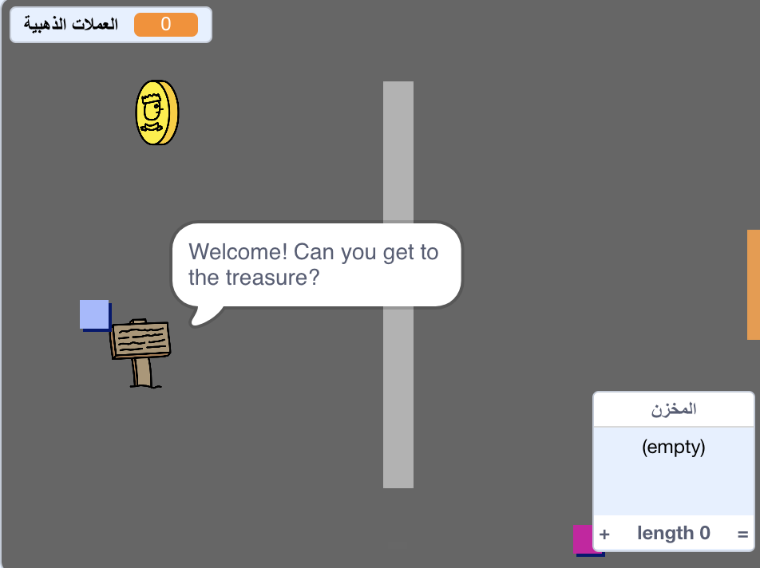

\--- no-print \---

هذا هو إصدار ** Scratch 3 ** من المشروع. هناك أيضًا [ إصدار Scratch 2 للمشروع ](https://projects.raspberrypi.org/en/projects/create-your-own-world-scratch2).

\--- /no-print \---

## المقدمة

In this project, you'll learn how to create your own adventure game world with multiple levels to explore.

### ما الذي ستصنعه

\--- no-print \---

انقر على العلم الأخضر للبدء. استخدم مفاتيح الأسهم لتحريك شخصيتك في أنحاء العالم.

  <iframe allowtransparency="true" width="485" height="402" src="https://scratch.mit.edu/projects/embed/258757783/?autostart=false" frameborder="0" scrolling="no"></iframe>
  

\--- /no-print \---

\--- print-only \---

You'll use the arrow keys to move your character around in the world. 

\--- /print-only \---

## \--- collapse \---

## title: ما الذي ستحتاجه

### الأجهزة

- جهاز كمبيوتر يدعم تشغيل برنامج Scratch 3

### البرامج

- برنامج Scratch 3 (سواء أكان [عبر الإنترنت](http://rpf.io/scratchon){:target="_blank"} أو [دون اتصال بالإنترنت](http://rpf.io/scratchoff){:target="_blank"})

### Downloads

You can find everything you need to complete this project at [rpf.io/p/en/create-your-own-world-go](https://rpf.io/p/en/create-your-own-world-go).

\--- collapse \---

## \--- collapse \---

## title: ما الذي ستتعلمه

- Use conditional selection to react to key presses
- Use variables to store a game's state
- Use conditional selection based on the value of a variable
- Use lists to store data

\--- /collapse \---

## \--- collapse \---

## title: معلومات إضافية للمعلمين

إذا كنت بحاجة إلى طباعة هذا المشروع ، فالرجاء استخدام الإصدار [الملائم للطابعة](https://projects.raspberrypi.org/en/projects/create-your-own-world/print){:target="_blank"}.

You can find the solutions to this project at [rpf.io/p/en/create-your-own-world-get](https://rpf.io/p/en/create-your-own-world-get).

\--- /collapse \---