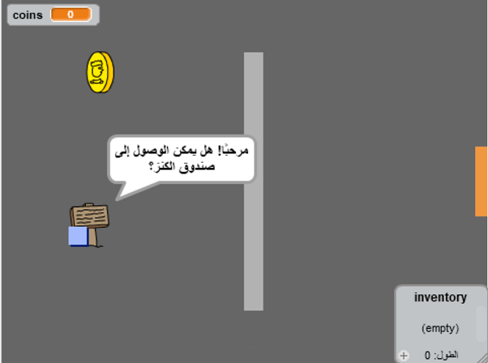

## المقدمة

في هذا المشروع، ستتعلم كيف تُنشئ لعبة مغامرات خاصة بك مليئة بغرف متعددة ليسكتشفها الاعب.

### ما الذي ستصنعه

انقر على العلم الأخضر للبدء. استخدم مفاتيح الأسهم لتحريك شخصيتك في أنحاء العالم.

  <iframe allowtransparency="true" width="485" height="402" src="https://scratch.mit.edu/projects/embed/34248822/?autostart=false" frameborder="0"></iframe>
  

### ما الذي ستتعلمه

يتناول هذا المشروع عناصر من معايير المناهج الرقمية الخاصة بـ [Raspberry Pi](http://rpf.io/curriculum){:target="_blank"}:

+ [دمج الإنشاءات البرمجية لحل مشكلة.](https://www.raspberrypi.org/curriculum/programming/builder){:target="_blank"}

### معلومات إضافية للمعلمين

إذا كنت بحاجة إلى طباعة هذا المشروع ، فالرجاء استخدام الإصدار [الملائم للطابعة](https://projects.raspberrypi.org/en/projects/create-your-own-world/print){:target="_blank"}.

استخدم الرابط الموجود بتذييل الصفحة للوصول إلى مستودع GitHub الخاص بهذا المشروع، والذي يضم كل الموارد (بما في ذلك مثال لنموذج مكتمل) في مجلد `en/resources`.