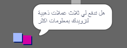
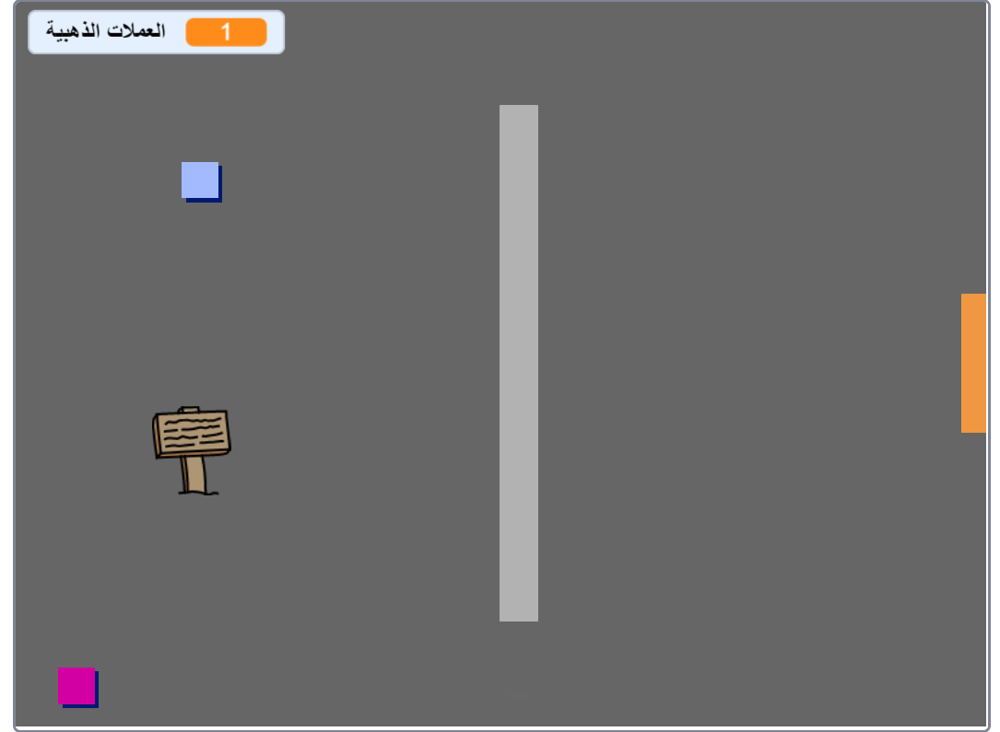
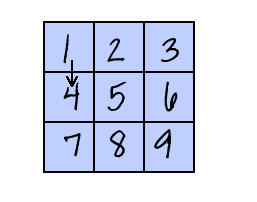

## تحدي: وسِّع عالمك

يمكنك الآن أن تُكمل إنشاء عالَمك الخاص! إليك بعض الأفكار:

+ Add more coins to your game in different rooms. Can you let some coins be guarded by patrolling enemies?
+ Change your game's backdrops
+ أضف موسيقى ومؤثرات صوتية إلى اللعبة
+ Add more people, enemies, and signs
+ أضف أبوابًا حمراء وصفراء، ومفاتيح خاصة لفتحها
+ أضف المزيد من الغرف إلى اللعبة
+ أضف عناصر أخرى مفيدة إلى اللعبة
    
    + استخدم العملات الذهبية للحصول على معلومات من الأشخاص:



+ يمكنك أيضًا إضافة أبواب في الحائطَين العلوي والسفلي للغرفة 1، بحيث يتمكن اللاعب من التحرك بين الغرف في كل الاتجاهات الأربعة. For example, your game can have nine rooms in a 3×3 grid. ثم يمكنك إضافة `3` إلى رقم الغرفة للنزول مستوى واحدًا.





```blocks3
if <touching color [ ]?> then
switch backdrop to ((costume [number v]) + (3))
go to x:(0) y:(200)
change [room v] by (3)
```