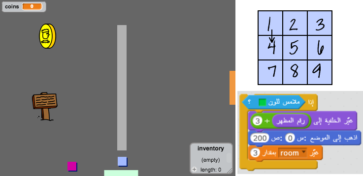

\--- challenge \---

## التحدي: وسِّع عالمك

يمكنك الآن أن تُكمل إنشاء عالَمك الخاص! إليك بعض الأفكار:

+ غيِّر خلفية اللعبة ورسوماتها
+ أضف موسيقى ومؤثرات صوتية إلى اللعبة
+ أضف المزيد من الأشخاص والأعداء واللافتات والعملات الذهبية
+ أضف أبوابًا حمراء وصفراء، ومفاتيح خاصة لفتحها
+ أضف المزيد من الغرف إلى اللعبة
+ أضف عناصر أخرى مفيدة إلى اللعبة

+ استخدم العملات الذهبية للحصول على معلومات من الأشخاص:

+ You could even add doors in the north and south walls of room 1, so that the player can move between rooms in all four directions. For example, if you had nine rooms, you could think of them as being in a 3×3 grid. You can then add `3` to the room number to move down one level.

\--- /challenge \---