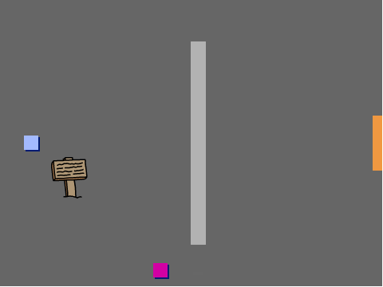

## تحريك كائن اللاعب

لنبدأ بإنشاء كائن `اللاعب` الذي يمكنه أن يتحرك في جميع أرجاء اللعبة.

--- task ---

افتح المشروع المبدئي "إنشاء عالمك الخاص".

**بالاتصال بالانترنت**: افتح المشروع المبدئي من هنا [rpf.io/create-your-own-world-on](http://rpf.io/create-your-own-world-on){:target="_blank"}.

اذا كنت تملك حساب على منصة السكراتش (Scratch) فيمكنك عمل نسخة بالضغط على **Remix**.

**بدون اتصال انترنيت** حمّل المشروع المبدئي من [rpf.io/p/ar-SA/create-your-own-world-go](http://rpf.io/p/ar-SA/create-your-own-world-go){:target="_blank"} ثم اقتحه باستخدام محرر البرنامج بدون اتصال انترنيت. اذا تحتاج تنزيل وتنصيب برنامج السكراتش Scratch على جهازك الشخصي، ستجده في [rpf.io/scratchoff](https://rpf.io/scratchoff){:target="_blank"}.



--- /task ---

عند الضغط على مفاتيح الأسهم يجب أن يتحرك كائن `اللاعب` بالارجاء. عند الضغط على سهم الأعلى، يجب أن يستجيب كائن `اللاعب` بالتحرك إلى أعلى المنصة.

--- task ---

أضف هذه التعليمات البرمجية إلى كائن `اللاعب`:


```blocks3
when flag clicked
forever
    if <key (up arrow v) pressed? > then
        point in direction (0)
        move (4) steps
    end
end
```

--- /task ---

--- task ---

انقر فوق العلم ثم اضغط على السهم لأعلى. هل تحرك كائن `اللاعب` إلى أعلى؟


--- /task ---

--- task ---

لتحريك كائن `اللاعب` إلى اليسار، تحتاج إلى إضافة كتلة `اذا`{:class="block3control"} اخرى مع نفس التعليمة البرمجية:


```blocks3
when flag clicked
forever
    if <key (up arrow v) pressed? > then
        point in direction (0)
        move (4) steps
    end
+   if <key (left arrow v) pressed? > then
        point in direction (-90)
        move (4) steps
    end
end
```

--- /task ---

--- task ---

أضف تعليمات برمجية أخرى لكائن `اللاعب` بحيث يتحرك إلى أسفل وإلى اليمين أيضاً. استخدم التعليمة البرمجية التي لديك لمساعدتك.

--- hints ---


--- hint ---

للتحرك للأعلى، اجعل كائن `اللاعب` بالاتجاه `0` درجة. مالذي ستفعله لتحريك الكائن إلى أسفل؟

للتحرك إلى اليسار، اجعل الكائن باتجاه `-90` درجة. مالذي ستفعله لتحريك الكائن إلى اليمين؟

--- /hint ---

--- hint ---

تحتاج إلى تغيير هاتين الكتلتين البرمجيتين:


```blocks3
<key ( v) pressed>

point in direction ()
```

قم بتكرار التعليمات البرمجية التي تجعل كائن `اللاعب` يتحرك إلى أعلى، وتغيير هاتين الكتلتين البرمجية لجعل الكائن يتحرك إلى الأسفل. قم بتكرار التعليمة البرمجية مرة أخرى، وتغييرها لجعل الكائن يتحرك إلى اليمين.

--- /hint ---

--- hint ---

هذا ما ينبغي ان تبدو عليه تعليماتك البرمجية:


```blocks3
when flag clicked
forever
    if <key (up arrow v) pressed? > then
        point in direction (0)
        move (4) steps
    end
    if <key (left arrow v) pressed? > then
        point in direction (-90)
        move (4) steps
    end

+    if <key (down arrow v) pressed? > then
        point in direction (180)
        move (4) steps
    end
+    if <key (right arrow v) pressed? > then
        point in direction (90)
        move (4) steps
    end
end
```

--- /hint ---

--- /hints ---

--- /task ---