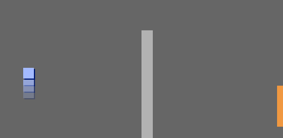

## تحريك كائن `اللاعب`

لنبدأ بإنشاء كائن `اللاعب` الذي يمكنه أن يتحرك في جميع أرجاء اللعبة.

+ إذا كنتَ تستخدم برنامج Scratch عبر الإنترنت، فافتح مشروع 'أنشئ عالمك الخاص' لبرنامج Scratch على <http://jumpto.cc/world-go>{:target="_blank"}. وإذا كنتَ تستخدم برنامج Scratch دون اتصال بالإنترنت، فنزِّل المشروع من [هنا](http://jumpto.cc/world-get){:target="_blank"}, ثم افتحه باستخدام المحرر الموجود على جهازك. 


سيستخدم الشخص الذي يلعب اللعبة مفاتيح الأسهم لتحريك كائن `اللاعب`في كل مكان. فعندما يضغط الشخص على مفتاح السهم إلى أعلى، ستأمر كائن `اللاعب` بالتحرك لأعلى.

+ أضف هذه التعليمات البرمجية إلى كائن `اللاعب`:

```blocks
    عند نقر ⚑
كرر باستمرار 
  إذا <مفتاح [السهم العلوي v] مضغوط؟>
  end
end؟ > then
اتجه نحو الاتجاه (0)
تحرك (4) خطوة
end
end
```

+ اختبر كائن `اللاعب` بالنقر على العلم ثم الضغط مطولاً على مفتاح سهم إلى أعلى. هل تحرك كائن `اللاعب` إلى أعلى؟
    
    

+ لتحريك كائن `اللاعب` إلى اليسار، تحتاج إلى إضافة قالب`if`{:class="blockcontrol"} آخر إليه بالتعليمة البرمجية نفسها:

```blocks
    عند نقر ⚑
كرر باستمرار 
  إذا <مفتاح [السهم العلوي v] مضغوط؟>
  end
end؟ > then
اتجه نحو الاتجاه (0)
تحرك (4) خطوة
end
إذا <مفتاح [السهم الأيسر v] مضغوط؟>
end؟ &gt; اتجه نحو الاتجاه (90-)
تحرك (4) خطوات 
النهاية 
النهاية
```

+ أضف تعليمات برمجية أخرى لكائن `اللاعب` بحيث يتحرك إلى أسفل وإلى اليمين أيضاً. واستخدم التعليمة البرمجية التي لديك لمساعدتك.

\--- hint \--- \--- hint \--- لتحريك لأعلى، وجهت كائن `اللاعب` بإتجاه `0` درجة. مالذي ستفعله لتحريك الكائن إلى أسفل؟

لتحريك إلى اليسار، وجهت الكائن بإتجاه `-90` درجة. مالذي ستفعله لتحريك الكائن إلى اليمين؟ \--- hint \--- \--- hint \--- تحتاج إلى تغيير هاتين التعليمتين البرمجية:

```blocks
<مفتاح [ v] مضغوط؟>
```

```blocks
اتجه نحو الإتجاه ()
```

كرر التعليمة البرمجية التي استخدمتها لتحريك لأعلى، لكن غير هاتتين التعليمتين البرمجية لتجعل كائن `اللاعب` يتحرك لأسفل. وافعل الشيء نفسه لتحريك لليمين. \--- hint \--- \--- hint \--- وهنا كيف يجب أن تكون التعليمات البرمجية لديك:

 \--- hint \--- \--- hint \---