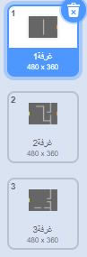
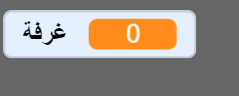

## التحرك حول عالمك الخاص

`اللاعب ` يجب أن يكون قادرا على التحرك عبر الأبواب للغرف الأخرى.

يحتوي مشروعك على خلفيات لغرف إضافية:



\--- task \---

أنشىء متغير جديد لكل الكائنات يسمى `غرفة`{:class="block3variables"} لتتبع الغرفة التي يكون `اللاعب ` موجودا فيها.

[[[generic-scratch3-add-variable]]]



\--- /task \---

\--- task \---

عندما يلمس كائن `اللاعب` الباب البرتقالي في الغرفة الأولى، يجب أن تظهر الخلفية الثانية، ويجب أن يتحرك كائن `اللاعب` إلى الخلف ناحية اليسار من المنصة. أضف هذه التعليمة البرمجية إلى كائن `اللاعب` داخل حلقة التكرار `كرر باستمرار`{:class="block3control"}:


```blocks3
when flag clicked
forever
    if <key (up arrow v) pressed? > then
        point in direction (0)
        move (4) steps
    end
    if <key (left arrow v) pressed? > then
        point in direction (-90)
        move (4) steps
    end
        if <key (down arrow v) pressed? > then
        point in direction (180)
        move (4) steps
    end
        if <key [right arrow v] pressed? > then
        point in direction (90)
        move (4) steps
    end
    if < touching color [#BABABA]? > then
    move (-4) steps
    end
+   if < touching color [#F2A24A] > then
    switch backdrop to (next backdrop v)
    go to x: (-200) y: (0)
    change [room v] by (1)
    end
end
```

\--- /task \---

\--- task \---

في كل مرة تبدأ فيها اللعبة، تحتاج الغرفة وموقع الشخصية والخلفية إلى إعادة تعيين.

أضف هذه التعليمية البرمجية إلى **بداية** التعليمة البرمجية لكائن ` الاعب` الخاص بك أعلى التعليمة البرمجية `كرر باستمرار `{:class="block3control"} لتتأكد من عودة كل شيء إلى الحالة الأولى عند النقر على العلم:

\--- hints \---

\--- hint \---

عندما تبدأ اللعبة:

+ قيمة `الغرفة`{:class="block3variables"} يجب أن تكون مضبوطة على `1 ` 
+ قيمة `الخلفية`{:class="block3looks"} يجب أن تكون مضبوطة على `غرفة1`{:class="block3looks"}
+ يجب تعيين موضع كائن `اللاعب ` إلى `س: -200 ص: 0`{:class="block3motion"}

\--- /hint \---

\--- hint \---

هنا التعليمات البرمجية التي ستحتاج اليها:


```blocks3
go to x: (-200) y: (0)

set [room v] to (1)

switch backdrop to (room1 v)
```

\--- /hint \---

\--- hint \---

إليك ما يجب أن يبدو عليه التعليمة البرمجية النهائي الخاصة بك:


```blocks3
when flag clicked
+set [room v] to (1)
+go to x: (-200) y: (0)
+switch backdrop to (room1 v)
forever
    if <key (up arrow v) pressed? > then
        point in direction (0)
        move (4) steps
    end
    if <key (left arrow v) pressed? > then
        point in direction (-90)
        move (4) steps
    end
        if <key (down arrow v) pressed? > then
        point in direction (180)
        move (4) steps
    end
        if <key [right arrow v] pressed? > then
        point in direction (90)
        move (4) steps
    end
    if < touching color [#BABABA]? > then
    move (-4) steps
    end
    if < touching color [#F2A24A] > then
    switch backdrop to (next backdrop v)
    go to x: (-200) y: (0)
    change [room v] by (1)
end
end
```

\--- /hint \---

\--- /hints \---

\--- /task \---

\--- task \---

انقر فوق العلم، ثم انقل كائن `اللاعب ` حتى يلمس الباب البرتقالي. هل ينتقل الكائن إلى الشاشة التالية؟ هل يتغير المتغير الخاص بــ `الغرفة`{:class="block3variables"} الي القيمة `2`؟


\--- /task \---