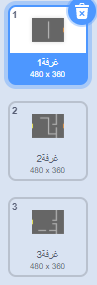
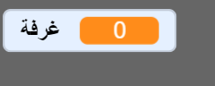
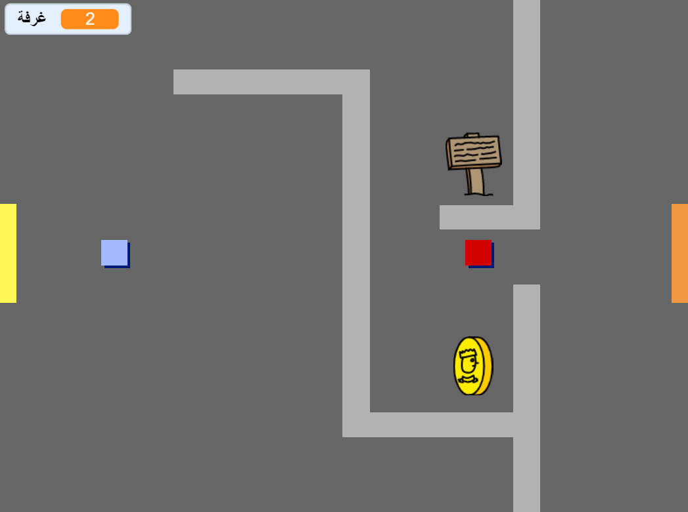

## برمج عالمك

لنسمح لكائن `اللاعب` العبور من خلال الأبواب إلى الغرف الأخرى.

يحتوي مشروعك على خلفيات لغرف إضافية:



+ أنشىء متغير جديد لكل الكائنات يسمى `غرفة`{:class="blockdata"} لتتبع الغرفة التي يكون كائن `اللاعب`موجود فيها.

[generic-scratch-add-variable]



+ عندما يلمس كائن `اللاعب` الباب البرتقالي في الغرفة الأول، يجب أن تظهر الخلفية الثانية، ويجب أن يتحرك كائن `اللاعب` إلى الخلف ناحية اليسار من المنصة. أضف هذه التعليمة البرمجية إلى كائن `اللاعب` داخل حلقة `كرر باستمرار`{:class="blockcontrol"}:

```blocks
    إذا < ملامس اللون  [#F2A24A]   >
غير الخلفية إلى [next backdrop v]
إذهب إلى موضع س: (200-) ص:(0)
غير [room v] بـمقدار (1)
النهاية
```

+ أضف هذه التعليمية البرمجية إلى **بداية** التعليمة البرمجية لكائن `اللاعب` (أعلى حلقة `كرر بأستمرار` {:class="blockcontrol"}) لتتأكد من عودة كل شيء إلى حالة الأول عند النقر على العلم:
    
    ```blocks
        اجعل [room v] مساوياً (1)
    إّهب إلى الموضع س: (200-) ص: (0)
    غير الخلفية إلى  [room1 v]
    ```

+ انقر على العلم وحرك كائن `اللاعب` ليمر عبر الباب البرتقالي. هل يتحرك الكائن إلى الشاشة التالية؟ Does the `room`{:class="blockdata"} variable change to `2`?



\--- challenge \---

### Challenge: moving to the previous room

+ Can you make your `player` sprite move to the previous room when they touch a yellow door? The code you need for this is very similar to the code you've already added for moving to the next room.

\--- /challenge \---