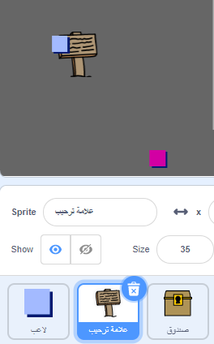
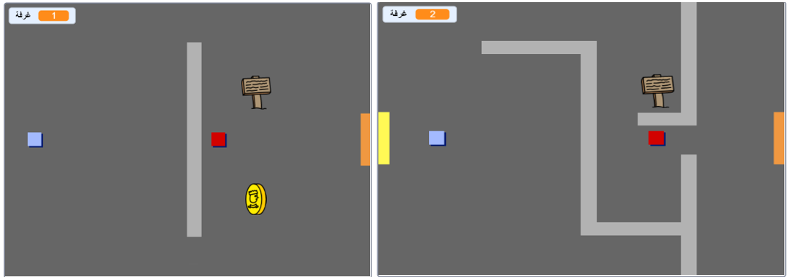
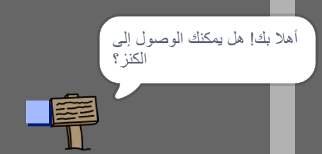

## اللافتات

دعنا نُضِف لافتات إلى لعبتك لتوجيه اللاعب على مدار اللعبة.

يحتوي مشروعك على كائن `لافتة الترحيب`:



\--- task \--- يجب أن يظهر كائن `لافتة الترحيب` في الغرفة الأولي فقط، لذا أضف بعض التعليمات البرمجية إلى كائن لافتة الترحيب لتضمن حدوث ذلك:

\--- hints \--- \--- hint \--- `عند الضغط علي العلم`{:class="block3events"}, في حلقة `forever`{:class="block3control"} يجب فحص `اذا كان`{:class="block3control"} the `room الغرف 1`{:class="block3variables"} وفي تلك الحالة `اعرض`{:class="block3looks"} `لافتة الترحيب `, `غير ذلك`{:class="block3control"} `اخفي`{:class="block3looks"} لافتة الترحيب. \--- /hint \--- \--- hint \--- فيما يلي التعليمات البرمجية التي ستحتاج إليها:


```blocks3
<br />if < > then
else
end

< (room :: variables) = [1] >

hide

show

forever
end

when flag clicked

```

\--- /hint \--- \--- hint \--- هذه هي التعليمات البرمجية النهائية:


```blocks3
when flag clicked
forever
    if < (room :: variables) = [1] > then
        show
    else
        hide
    end
end
```

\--- /hint \--- \--- /hints \---

\---/task\---

\--- task \--- اختبر الكود الخاص ` بلافتة الترحيب ` عن طريق الانتقال بين الغرف. يجب أن تظهر اللافتة في الغرفة 1 فقط.

 \--- /task \---

\--- task \--- اللافتة لاتكون مفيدة اذا لم تحتوي علي شئ! أضف بعض الرموز لعرض رسالة إذا كان كائن `لافتة الترحيب` يلامس كائن `اللاعب`:


```blocks3
when flag clicked
forever
if < (room :: variables) = [1] > then
show
else
hide
end
+if < touching (player v)? > then
say [Welcome! Can you get to the treasure?]
else
say []
end
end
```

\--- /task \---

\--- task \--- Test your `welcome sign` sprite again. يجب أن تشاهد الآن رسالة عندما يتلامس `اللاعب ` و `علامة الترحيب`.

 \--- /task \---