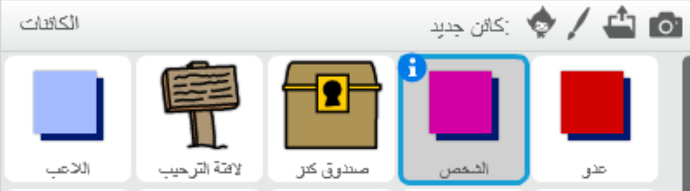
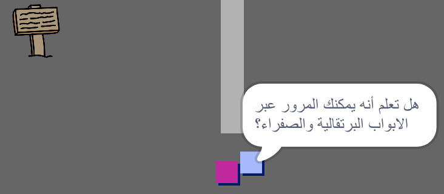

## الأشخاص

لنُضِيف أشخاصًا آخرين إلى لعبتك ليتعامل معها كائن `اللاعب`.

+ عُد إلى كائن `الشخص`.



+ أضف بعض التعليمات البرمجية إلى كائن `الشخص`، ليتحدث مع كائن `اللاعب`. هذه التعليمة البرمجية تشبه إلى حدٍ كبير التعليمة البرمجية التي أضفتها إلى كائن`لافتة `:

```blocks
    when flag clicked
    go to x: (0) y: (-150)
    forever
        if < touching [player v]? > then
            say [Did you know that you can go through orange and yellow doors?]
        else
            say []
        end
    end
```

+ You could also allow your `person` sprite to move by adding these two blocks in the `else`{:class="blockcontrol"} section of your code:

```blocks
move (1) steps
if on edge, bounce
```

Your `person` sprite will now move, but will stop to talk to the `player` sprite.



\--- challenge \---

### Challenge: improve the person

Can you add code to your new `person` sprite so that they only appear in room 1? Make sure you test out your new code.

\--- /challenge \---