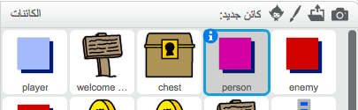

## الأشخاص

لنُضِيف أشخاصًا آخرين إلى لعبتك ليتعامل معها كائن `اللاعب`.

+ عُد إلى كائن `الشخص`.



+ أضف بعض التعليمات البرمجية إلى كائن `الشخص`، ليتحدث مع كائن `اللاعب`. هذه التعليمة البرمجية تشبه إلى حدٍ كبير التعليمة البرمجية التي أضفتها إلى كائن`لافتة`:

```blocks
    عند نقر ⚑
اذهب إلى الموضع س: (0) ص: (-150)
كرر باستمرار 
  إذا <ملامس لـ [player v] ؟>
  end
end > then
قل [هل تعلم أنه يمكنك المرور عبر الأبواب البرتقالية والصفراء؟]
else
قل []
end
end
```

+ ويمكنك أيضًا أن تسمح لكائن `الشخص` بالتحرك عن طريق إضافة هذين القالبين البرمجيين في التعليمة البرمجية `else`{:class="blockcontrol"}:

```blocks
تحرك (1) خطوة
ارتد إذا كنت عند الحافة
```

سيتحرك الآن كائن `الشخص`، لكن لن يتوقف ليتحدث مع كائن `اللاعب`.


\--- challenge \---

### التحدي: تحسين الشخص

هل يمكنك إضافة تعليمة برمجية جديدة إلى كائن `الشخص` بحيث يظهر في الغرفة 1 فقط؟ تأكد من اختبار التعليمة البرمجية الجديدة.

\--- challenge \---