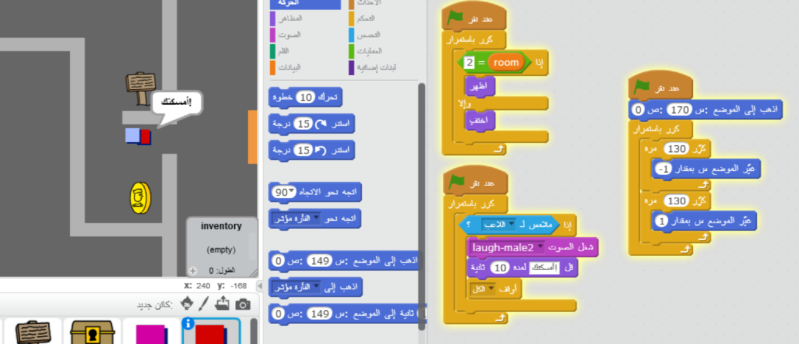

\--- challenge \---

## التحدي: إضافة عدو

يمكنك أيضًا إضافة أعداء يقومون بدوريات حراسة. وإذا لمس اللاعب عدوًا، فستنتهي اللعبة.

+ أضف تعليمة برمجية إلى الكائن`عدو (enemy)` بحيث لا يظهر إلّا في الغرفة 2.

+ أضف تعليمة برمجية لتحريك الكائن `عدو (enemy)`، ولتنتهي اللعبة إذا لمس الكائن `عدو (enemy)` الكائنَ `اللاعب`. من الأسهل أن تكون التعليمات البرمجية على هيئة قوالب منفصلة. يجب أن تكون التعليمة البرمجية للكائن`عدو` كما يلي:

+ + أنه لا يظهر إلا في الغرفة 2
    + أنه يحرس الغرفة
    + أن اللعبة تنتهي إذا لمسه كائن`اللاعب`

\--- challenge \---

\--- challenge \---

## التحدي: زيادة عدد الأعداء

هل يمكنك إنشاء كائن `عدو (enemy)` آخر في الغرفة 3 يتحرك إلى أعلى وإلى أسفل لحراسة الفتحة الموجودة في الحائط؟

\--- challenge \---