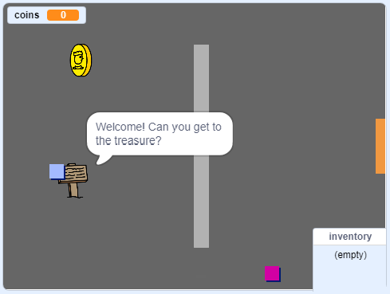

--- no-print ---

এটি **Scratch 3** প্রকল্পের একটি সংস্করণ।. এই প্রকল্পের একটি [Scratch 2 version of the project](https://projects.raspberrypi.org/bn-IN/projects/create-your-own-world-scratch2) ও রয়েছে.

--- /no-print ---

## ভূমিকা

এই প্রকল্পে আপনি আপনার নিজের অ্যাডভেঞ্চার গেম ওয়ার্ল্ড তৈরি করতে শিখবেন এবং এই গেমএ আপনি একাধিক স্তর অন্বষণে করতে পারবেন.

### আপনি যা বানাবেন

--- no-print ---

শুরু করতে সবুজ পতাকায় ক্লিক করুন।. আপনার character টিকে বিশ্বের চারদিকে ঘোরাতে তীর চিহ্ন টি ব্যবহার করুন.

  <iframe allowtransparency="true" width="485" height="402" src="https://scratch.mit.edu/projects/embed/258757783/?autostart=false" frameborder="0" scrolling="no"></iframe>
  

--- /no-print ---

--- print-only ---

আপনার character টিকে বিশ্বের চারদিকে ঘোরাতে তীর চিহ্ন টি ব্যবহার করুন. 

--- /print-only ---

--- collapse ---
---
title: আপনার যা প্রয়োজন হবে
---

### Hardware

- Scratch 3 চালানোর জন্য সক্ষম একটি কম্পিউটার

### Software

- Scratch 3 (either [online](https://rpf.io/scratchon){:target="_blank"} or [offline](https://rpf.io/scratchoff){:target="_blank"})

### Downloads

এই প্রকল্পটি সম্পন্ন করার জন্য আপনার প্রয়োজনীয় সমস্ত কিছু আপনি এখানে পাবেন[rpf.io/p/bn-IN/create-your-own-world-go](https://rpf.io/p/bn-IN/create-your-own-world-go)।.

--- /collapse ---

--- collapse ---
---
title: যা আপনি শিখবেন
---

- কী চাপার প্রতিক্রিয়া জানাতে conditional selection ব্যবহার করুন
- গেমের অবস্থা সঞ্চয় করতে ভেরিয়েবল ব্যবহার করুন
- একটি ভেরিয়েবলের মানের ভিত্তিতে শর্তসাপেক্ষ নির্বাচন ব্যবহার করুন
- ডেটা সঞ্চয় করতে তালিকাগুলি ব্যবহার করুন

--- /collapse ---

--- collapse ---
---
title: শিক্ষাবিদদের জন্য অতিরিক্ত তথ্য
---

আপনি যদি এই প্রজেক্টটি প্রিন্ট করতে চান তবে [printer-friendly version](https://projects.raspberrypi.org/bn-IN/projects/create-your-own-world/print){:target="_blank"} ব্যবহার করুন ।.

আপনি সমাপ্ত প্রকল্প গুলি [completed project here](https://rpf.io/p/bn-IN/create-your-own-world-get){:target="_blank"} এখানে পেতে পারেন.

--- /collapse ---
