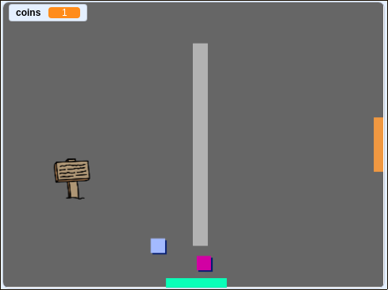

## Challenge: আপনার জগৎ প্রসারিত করুন

আপনি এখন আপনার নিজের জগৎ তৈরি চালিয়ে যেতে পারেন! এখানে কিছু ধারনা দেওয়া হলো:

+ বিভিন্ন ঘরে আপনার গেমটিতে আরও কয়েন যুক্ত করুন।. প্রতিপক্ষদের পাহারা দিয়ে আপনি কি আপনার মুদ্রা রক্ষা করতে পারেন?
+ আপনার গেমের ব্যাকড্রপগুলি পরিবর্তন করুন
+ আপনার গেমটিতে শব্দ এবং সঙ্গীত যুক্ত করুন
+ আরও লোক, প্রতিপক্ষ এবং চিহ্ন যুক্ত করুন
+ লাল এবং হলুদ দরজা যুক্ত করুন এবং এগুলি খোলার জন্য বিশেষ চাবি যুক্ত করুন
+ আপনার গেম এ আরো কক্ষ যুক্ত করুন
+ আপনার গেমটিতে অন্যান্য দরকারী আইটেম যুক্ত করুন
    
    + অন্যান্য লোকের কাছ থেকে তথ্য পেতে কয়েন ব্যবহার করুন:


+ এমনকি আপনি কক্ষ 1 এর উত্তর এবং দক্ষিণ দেয়ালগুলিতে দরজা যুক্ত করতে পারেন, যাতে প্লেয়ারটি চার দিকের কক্ষগুলির মধ্যে যাতায়াত করতে পারে।. উদাহরণস্বরূপ, আপনার গেমটিতে 3 × 3 গ্রিডে নয়টি কক্ষ থাকতে পারে।. তারপরে আপনি এক স্তর নীচে যেতে রুম নম্বরটিতে `3` যুক্ত করতে পারেন।.




```blocks3
if <touching color [ ]?> then
switch backdrop to ((costume [number v]) + (3))
go to x:(0) y:(200)
change [room v] by (3)
```