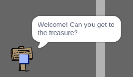

## লক্ষণ বা signs

খেলোয়াড়দের ভ্রমণের পথে তাদের নির্দেশ দেবার জন্য এখন আপনার বিশ্বে লক্ষণ/signs যুক্ত করুন।.

আপনার প্রকল্পে একটি `welcome sign` sprite রয়েছে:


--- task ---

`welcome sign` sprite টি কেবলমাত্র কক্ষ 1 এ দৃশ্যমান হওয়া উচিত, সুতরাং sprite এ কিছু কোড যুক্ত করুন তা নিশ্চিত হওয়ার জন্য:

--- hints ---


--- hint ---

`When the flag is clicked`{:class="block3events"}, in a `forever`{:class="block3control"} loop, check `if`{:class="block3control"} the `room is 1`{:class="block3variables"} and in that case `show`{:class="block3looks"} `welcome sign` sprite, `else`{:class="block3control"} `hide`{:class="block3looks"} the sprite.

--- /hint ---

--- hint ---

Here are the blocks you need:


```blocks3
if < > then
else
end

< (room :: variables) = [1] >

hide

show

forever
end

when flag clicked

```

--- /hint ---

--- hint ---

এখানে আছে সম্পূর্ণ কোড:


```blocks3
when flag clicked
forever
    if < (room :: variables) = [1] > then
        show
    else
        hide
    end
end
```

--- /hint ---

--- /hints ---

--- /task ---

--- task ---

আপনার `welcome sign` র জন্য ঘর গুলোর মধ্যে চলাচল করে কোডটি পরীক্ষা করুন।. সাইনটি কেবল রুম 1 এ দৃশ্যমান হওয়া উচিত।.


--- /task ---

--- task ---

কোনও চিহ্ন না বললে কিছু ভাল হয় না! যদি `welcome sign` sprite, `player` sprite কে স্পর্শ করে তবে একটি বার্তা প্রদর্শন করতে আরও কিছু কোড যুক্ত করুন:


```blocks3
when flag clicked
forever
if < (room :: variables) = [1] > then
show
else
hide
end
+if < touching (player v)? > then
say [Welcome! Can you get to the treasure?]
else
say []
end
end
```

--- /task ---

--- task ---

আপনার `welcome sign` আবার পরীক্ষা করুন।. `player` sprite, `welcome sign` sprite স্পর্শ করলে আপনার এখন একটি বার্তা দেখা উচিত।.



--- /task ---