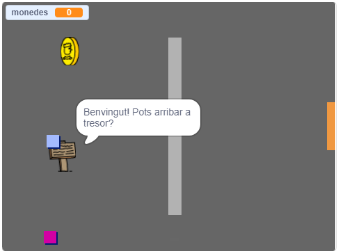

\--- no-print \---

Es tracta de la versió ** Scratch 3 **del projecte. També hi ha una [ versió de Scratch 2 del projecte ](https://projects.raspberrypi.org/en/projects/create-your-own-world-scratch2).

\--- /no-print \---

## Introducció

En aquest projecte, aprendràs a crear el teu propi món de jocs d’aventura amb diversos nivells per explorar.

### Què faràs

\--- no-print \---

Fes clic a la bandera verda per començar. Utilitza les tecles de fletxa per moure el teu personatge pel món.

  <iframe allowtransparency="true" width="485" height="402" src="https://scratch.mit.edu/projects/embed/258757783/?autostart=false" frameborder="0" scrolling="no"></iframe>
  

\--- / no-print \---

\--- print-only \---

Utilitza les tecles de fletxa per moure el teu personatge pel món. 

\--- /print-only \---

## \--- collapse \---

## títol: què necessitaràs

### Maquinari

- Un ordinador capaç d'executar Scratch 3

### Programari

- Scratch 3 (tant [en línia](http://rpf.io/scratchon){: target = "_ blank"} o [fora de línia](http://rpf.io/scratchoff){: target = "_ blank"})

### Descàrregues

Pots trobar tot el que necessites per completar aquest projecte a [ rpf.io/p/en/create-your-own-world-go ](https://rpf.io/p/en/create-your-own-world-go).

\--- / collapse \---

## \--- collapse \---

## títol: Què aprendràs

- Fes servir la selecció condicional per reaccionar en prémer les tecles
- Utilitza variables per emmagatzemar l’estat d’un joc
- Fes sevir la selecció condicional en funció del valor d’una variable
- Utilitza llistes per emmagatzemar dades

\--- / collapse \---

## \--- collapse \---

## títol: Informació addicional per educadors

Si necessites imprimir aquest projecte, si us plau, utilitza la [versió per imprimir](https://projects.raspberrypi.org/en/projects/create-your-own-world/print){:target="_blank"}.

Pots trobar el [projecte complet aquí](https://rpf.io/p/en/create-your-own-world-get)"}.

\--- / collapse \---