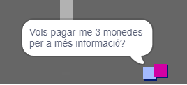
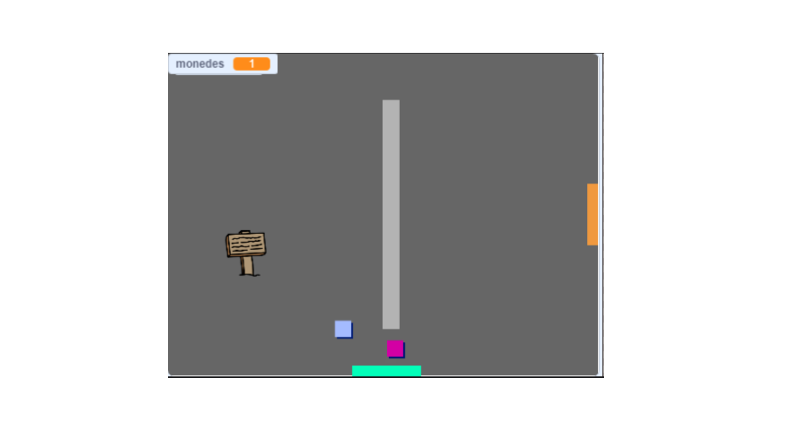

## Repte: ampliar el teu món

Ara pots continuar creant el teu propi món! Aquí tens algunes idees:

+ Afegeix més monedes al teu joc a diferents habitacions. Pots deixar que patrulles d'enemics guardin algunes monedes?
+ Canvia l'escenari del joc
+ Afegeix so i música al teu joc
+ Afegeix més persones, enemics i senyals
+ Afegeix portes vermelles i grogues i claus especials per obrir-les
+ Afegeix més habitacions al teu món
+ Afegeix altres elements útils al teu joc
    
    + Utilitza monedes per obtenir informació d'altres persones:



+ Fins i tot podries afegir portes a les parets nord i sud de l'habitació 1, de manera que el jugador es pugui moure entre habitacions en les quatre direccions. Per exemple, el joc pot tenir nou habitacions en una graella 3 × 3. Pots afegir ` 3 ` al número de l’habitació per baixar un nivell.




```blocks3
si <touching color [ ]?> aleshores
canvia el teló de fons a ((vestuari [número v]) + (3))
ves a x: (0) y: (200)
canvia [habitació v] per (3)
```