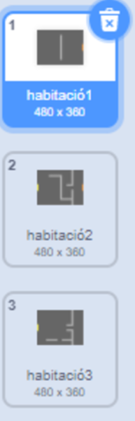
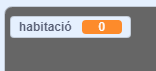
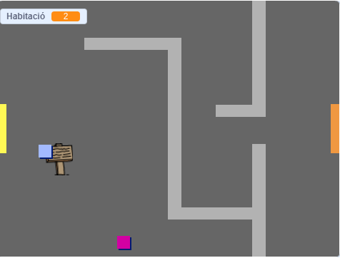

## Mou-te pel teu món

La icona `jugador ` hauria de poder entrar per les portes a altres habitacions.

El teu projecte conté escenaris per a habitacions addicionals:



\--- task \---

Crea una nova variable "per a totes les icones" anomenada ` habitació ` {: class = "block3variables"} per fer un seguiment de en quina habitació està la icona ` jugador`.

[[[generic-scratch3-add-variable]]]



\--- /task \---

\--- task \---

When the `player` sprite touches the orange door in the first room, the game should display the next backdrop, and the `player` sprite should move back to the left side of the Stage. Add this code inside the `player` sprite's `forever`{:class="block3control"} loop:


```blocks3
quan has fet clic a la bandera
per sempre
    si has apretat <tecles (fletxa amunt v)? > llavors
        punt de direcció (0)
        moure (4) passes
    final
  si has apretat <tecles (fletxa esquerra v)? > llavors
        punt de direcció (-90)
        moure (4) passes
    final
  si has apretat <tecles (fletxa avall v)? > llavors
        punt de direcció (-180)
        moure (4) passes
    final
  si has apretat <tecles [fletxa dreta v]? > llavors
        punt de direcció (90)
        moure (4) passes
    final
 si < tocant el color [#BABABA]? > llavors
    moure (-4) passes
    final
+ si < tocant color [# F2A24A] > llavors
    canviar el teló de fons a (següent teló de fons v)
    anar a x: (-200) y: (0)
    canviar [habitació v] per (1)
    final
final
```

\--- /task \---

\--- task \---

Every time the game starts, the room, character position, and backdrop need to be reset.

Add code to the **start** of your `player` sprite code above the `forever`{:class="block3control"} loop, to reset everything when the flag is clicked:

\--- hints \---

\--- hint \---

When the game starts:

+ El valor de ` habitació ` {: class = "block3variables"} s'ha de definir a ` 1 ` {: class = "block3variables"}
+ El ` telo de fons ` {: class = "block3variables"} s'ha de definir a ` habitació 1 ` {: class = "block3variables"}
+ The position of the `player` sprite should be set to `x: -200 y: 0`{:class="block3motion"}

\--- /hint \---

\--- hint \---

Here are the extra blocks you need:


```blocks3
ves a x: (-200) y: (0)

estableix [habitació v] a (1)

canvia el teló de fons a (habitació1 v)
```

\--- /hint \---

\--- hint \---

Here's what your finished script should look like:


```blocks3
quan has fet clic a la bandera
+ estableix [habitació v] a (1)
+ ves a x: (-200) y: (0)
+ canvia el teló de fons a (sala1 v)
per sempre
    si has apretat <tecles (fletxa amunt v)? > llavors
        punt de direcció (0)
        moure (4) passes
    final
  si has apretat <tecles (fletxa esquerra v)? > llavors
        punt de direcció (-90)
        moure (4) passes
    final
  si has apretat <tecles (fletxa avall v)? > llavors
        punt de direcció (-180)
        moure (4) passes
    final
  si has apretat <tecles [fletxa dreta v]? > llavors
        punt de direcció (90)
        moure (4) passes
    final
 si < tocant el color [#BABABA]? > llavors
    moure (-4) passes
    final
+ si < tocant color [# F2A24A] > llavors
    canviar el teló de fons a (següent teló de fons v)
    anar a x: (-200) y: (0)
    canviar [habitació v] per (1)
    final
final
```

\--- /hint \---

\--- /hints \---

\--- /task \---

\--- task \---

Click the flag, and then move your `player` sprite until it touches the orange door. Does the sprite move to the next screen? Does the `room`{:class="block3variables"} variable change to `2`?



\--- /task \---