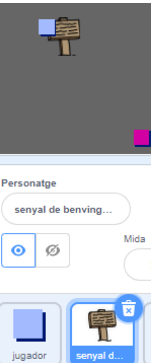
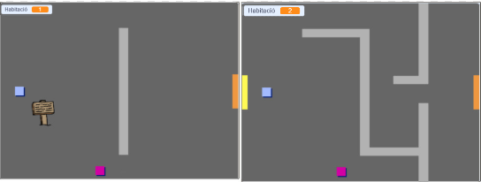
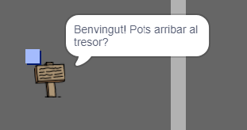

## Senyals

Ara afegeix senyals al teu món per guiar els jugadors en el seu viatge.

El teu projecte inclou una icona de ` senyal de benvinguda `:



\--- task \--- La icona de ` senyal de benvinguda ` només ha de ser visible a l'habitació 1, així que afegeix algun codi a la icona per assegurar-te que això passi:

\--- hints \---hint \--- ` Quan es fa clic a la bandera ` {: class = "block3events"}, en un bucle ` per sempre ` {: class = "block3control"}, comprova ` si ` {: class = "block3control"} la `habitació és 1 ` {: class = "block3variables"} i en aquest cas ` mostrar ` {: class = "block3looks"} la icona ` senyal de benvinguda `, ` si no ` {: class = "block3control"} ` amagar ` {: class = "block3looks"} la icona. \--- /hint \--- \--- hint \--- Aquí tens els blocs de codi que necessites:


```blocks3
<br />si < > llavors
si no
final

< (habitació :: variables) = [1] >

amagar

mostrar

per sempre
final

quan has fet clic a la bandera

```

\--- /hint \--- \--- hint \--- Aquí tens el codi sencer:


```blocks3
quan has fet clic a la bandera
per sempre
    si < (habitació :: variables) = [1] > llavors,
        mostren
    si no
        amaguen
    final
final
```

\--- /hint \--- \--- /hints \---

\--- /task \---

\--- task \--- Prova el codi de la teva icona de ` senyal de benvinguda ` movent-te entre habitacions. El senyal només ha de ser visible a l'habitació 1.

 \--- /task \---

\--- task \--- Un senyal no és gaire bo si no diu res! Afegeix un codi més per mostrar un missatge si la icona de ` senyal de benvinguda ` toca la icona del `jugador `:


```blocks3
quan has fet clic a la bandera
per sempre
si < (habitació :: variables) = [1] > llavors,
mostra
si no
amaga
final
+ si < tocant (jugador v)? > llavors
digues [Benvingut! Pots arribar al tresor?]
si no
dir []
final
final
```

\--- /task \---

\--- task \--- Prova la teva icona `senyal de benvinguda` de nou. Ara hauries de veure un missatge quan la icona del `jugador ` toca la icona de ` senyal de benvinguda `.

 \--- /task \---