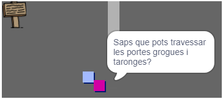

## Gent

Afegeix altres persones al teu món amb les que el teu ` jugador ` pugui interactuar.

\--- tasca \--- Canvia a la icona de `persona `.

 \--- /task \---

\--- tasca \--- Afegeix algun codi a la icona de `persona ` de manera que parli amb el `jugador `. Aquest codi és molt similar al que has afegit a la teva icona de ` senyal`:


```blocks3
quan has fet clic a la bandera
ves a x: (0) y: (-150)
per sempre
    si tocant < (jugador v)? > llavors
        digues [Sabies que pots passar per les portes taronjes i grogues?]
    si no
        dir []
    final
final
```

\--- /task \---

\--- task \--- Permet a la teva icona de `persona ` moure's afegint aquests dos blocs a la secció ` si no ` {: class = "block3control"} del teu codi:


```blocks3
quan has fet clic a la bandera
ves a x: (0) y: (-150)
per sempre
    si tocant < (jugador v)? > llavors
        digues [Sabies que pots passar per les portes taronjes i grogues?]
    si no
        dir []
+       mou (1) passes
+       si estàs al límit, salta
    final
final

```

\--- /task \---

La teva icona de ` persona` ara es mourà, però s’aturarà per parlar amb la icona del `jugador `.



\--- tasca \--- Afegeix codi a la teva nova icona de `persona ` de manera que només aparegui a la sala 1. El codi que necessites és exactament el mateix que el que fa la icona del `senyal ` només visible a la sala 1.

Assegura't de provar el nou codi. \--- /task \---