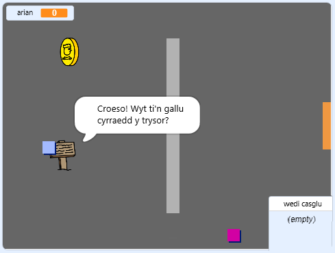

\--- no-print \---

Dyma'r fersiwn ** Scratch 3 ** y prosiect. Mae yna hefyd fersiwn [ Scratch 2 y prosiect ](https://projects.raspberrypi.org/en/projects/create-your-own-world-scratch2).

\--- /no-print \---

## Cyflwyniad

Yn y prosiect hwn, byddi di'n dysgu sut i greu byd gêm antur dy hunan gyda sawl lefel i'w archwilio.

### Yr hyn byddi di'n ei greu

\--- no-print \---

Clicia'r faner werdd i ddechrau. Defnyddia'r bysellau saeth i symud dy gymeriad o gwmpas y byd.

  <iframe allowtransparency="true" width="485" height="402" src="https://scratch.mit.edu/projects/embed/258757783/?autostart=false" frameborder="0" scrolling="no"></iframe>
  

\--- /no-print \---

\--- print-only \---

Byddi di'n defnyddio'r bysellau saeth i symud dy gymeriad o gwmpas y byd. 

\--- /print-only \---

## \---collapse\---

## title: Beth fydd ei angen arno ti

### Caledwedd

- Cyfrifiadur sy'n gallu rhedeg Scratch 3

### Meddalwedd

- Scratch 3 (unai [arlein](http://rpf.io/scratchon){:target="_blank"} neu [all-lein](http://rpf.io/scratchoff){:target="_blank"})

### Lawrlwythiadau

Gallwch ddod o hyd i bopeth sydd ei angen arnoch i gwblhau'r prosiect hwn yn [ rpf.io/p/en/create-your-own-world-go ](https://rpf.io/p/en/create-your-own-world-go).

\--- /collapse \---

## \---collapse\---

## title: Yr hyn byddi di'n ei ddysgu

- Defnyddio detholiad amodol i ymateb i wasgu botymau
- Defnyddio newidynnau i storio cyflwr y gêm
- Defnyddio detholiad amodol yn seiliedig ar werth newidyn
- Defnyddio rhestrau i storio data

\--- /collapse \---

## \---collapse\---

## title: Gwybodaeth ychwanegol i addysgwyr

Os oes angen i chi argraffu y prosiect, defnyddiwch [fersiwn i'w argraffu](https://projects.raspberrypi.org/en/projects/create-your-own-world/print){:target="_blank"}.

You can find the [completed project here](https://rpf.io/p/en/create-your-own-world-get){:target="_blank"}.

\--- /collapse \---