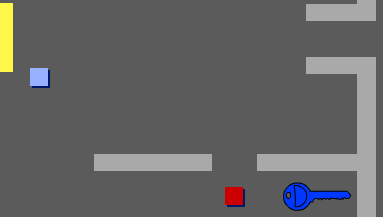

## Drysau ac allweddi

Rwyt ti nawr am ychwanegu côd i rai o dy ddrysau fel bod rhai o'r drysau yn y gêm wedi eu cloi, ac mae'n rhaid i'r chwaraewr ddod o hyd i allwedd i'w datgloi nhw a symud i'r ystafell nesaf.

--- task --- Newida i'r corlun `allwedd`. Clicia ar `dangor`{:class="blocklooks"} yn y dewislen fel bod y corlun yn ymddangos ar y Llwyfan. --- /task ---

--- task --- Golyga'r `allwedd` fel ei fod yn las. --- /task ---

--- task --- Newida cefndir dy Lwyfan i ystafell 3 a gosod yr `allwedd` mewn man anodd i'w gyrraedd!



--- /task ---

--- task --- Ychwanega gôd i dy `allwedd` i'w wneud yn weledol yn ystafell 3 yn unig. --- /task ---

--- task --- Cer ati i greu rhestr newydd o'r enw `rhestr`{:class="block3variables"} i storio'r eitemau mae dy `chwaraewr` yn eu casglu.

[[[generic-scratch3-make-list]]] --- /task ---

--- task --- Mae'r côd sydd angen i ti ei ychwanegu ar gyfer casglu allweddi yn debyg i'r côd ar gyfer casglu arian. Y gwahaniaeth yw fod angen ychwanegu allwedd i'r `rhestr`{:class="block3variables"}.


```blocks3
pan fo'r flag werdd yn cael ei glicio
aros hyd at <cyffwrdd (chwaraewr v) ?>
ychwanegu [allwedd glas] i [wedi casglu v]
cuddio
aros [sgriptiau eraill yn y ciplun v]
```

--- /task ---

--- task --- Ychwanega gôd i'r Llwyfan i wagio dy restr ar gychwyn gêm.

```blocks3
dileu (y cyfan v) o [wedi casglu v]
```

--- /task ---

--- task --- Profa dy gêm i weld os wyt ti'n gallu casglu'r `allwedd` a'i ychwanegu at y rhestr. --- /task ---

--- task --- Nawr ychwanega'r drws wedi ei gloi. Dewisa'r corlun `drws-glas` a chlicio `dangos`{:class="blocklooks} yn y ddewislen, yna gosod y corlun ar draws y bwlch rhwng y ddwy wal.

 --- /task ---

--- task --- Ychwanega gôd i'r `drws glas` fel ei fod ond yn weledol yn ystafell 3. --- /task ---

--- task --- Ychwanega gôd i'r `drws glas` fel fod, pan mae'r allwedd yn y `rhestr`{:class="block3variables"}, mae'r corlun yn `cuddio`{:class="block3looks"} i adael i dy `chwaraewr` fynd heibio.


```blocks3
pan fo'r flag werdd yn cael ei glicio
aros hyd at <[wedi casglu v] yn cynnwys [alwedd glas] ?>
aros [sgriptiau eraill yn y ciplun v]
cuddio
```

--- /task ---

--- task --- Profa dy gêm i weld os wyt ti'n gallu casglu'r allwedd glas i agor y drws! --- /task ---