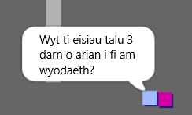
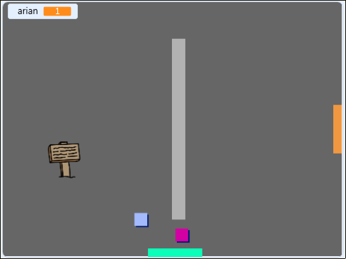

## Her: ymestyn dy fyd

Alli di nawr barhau i greu dy fyd dy hunan! Dyma rai syniadau:

+ Ychwanegu mwy o arian mewn gwahanol ystafelloedd. Alli di adael i'r arian gael ei warchod gan elynion?
+ Newid cefndir y gêm
+ Ychwanegu sain a cherddoriaeth i'r gêm
+ Ychwanegu mwy o bobl, gelynion ac arwyddion
+ Ychwanegu drysau coch a melyn, ac allweddi i'w agor nhw
+ Ychwanegu mwy o ystafelloedd
+ Ychwanegu mwy o eitemau defnyddiol i'r gêm
    
    + Defnyddio arian i gael gwybodaeth gan bobl arall:



+ Fe alli di hyd yn oed ychwanegu drysau gogledd a de, fel bod y chwaraewr yn symud rhwng ystafelloedd mewn pedwar cyfeiriad. Er enghraifft, os oes gen ti 9 ystafell, fe alli di feddwl amdanynt mewn grid 3x3. Fe alli di wedyn ychwanegu `3` i rif yr ystafell i symud lawr un lefel.

 

```blocks3
os <cyffwrdd lliw [ ] ?> yna 
  newid cefndir i ((gwisg [rhif v]) + (3))
  mynd i x: (0) y: (200)
  newid [ystafell v] gan (3)
end
```