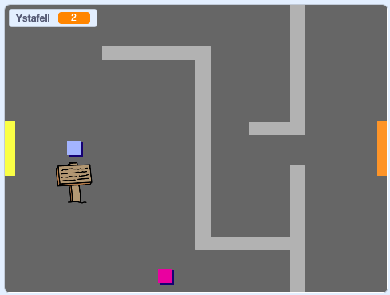

## Symud o gwmpas dy fyd

Fe ddylai'r `chwaraewr` allu gerdded trwy ddrysau i ystafelloedd eraill.

Mae dy brosiect yn cynnwys cefndir ar gyfer ystafelloedd ychwanegol:


\--- task \---

Byddi di angen newidyn newydd ‘ar gyfer pob ciplun’ o’r enw `ystafell`{:class="block3variables"} i wybod pa ystafell mae’r `chwaraewr` ynddo.

[[[generic-scratch3-add-variable]]]


\--- /task \---

\--- task \---

When the `player` sprite touches the orange door in the first room, the game should display the next backdrop, and the `player` sprite should move back to the left side of the Stage. Add this code inside the `player` sprite's `forever`{:class="block3control"} loop:


```blocks3
pan fo'r flag werdd yn cael ei glicio
am byth 
  os <bysell (up arrow v) wedi ei phwyso? > yna 
    pwyntio i gyfeiriad (0)
    symud (4) cam
  end
  os <bysell (left arrow v) wedi ei phwyso? > yna 
    pwyntio i gyfeiriad (-90)
    symud (4) cam
  end
  os <bysell (down arrow v) wedi ei phwyso? > yna 
    pwyntio i gyfeiriad (-180)
    symud (4) cam
  end
  os <bysell [right arrow v] wedi ei phwyso? > yna 
    pwyntio i gyfeiriad (90)
    symud (4) cam
  end
  os <cyffwrdd lliw [#BABABA] ? > yna 
    symud (-4) cam
  end
  + os <cyffwrdd lliw [#F2A24A] ?> yna 
     newid cefndir i (next backdrop v)
     mynd i x: (-200) y: (0)
     newid [room v] gan (1)
     end
end
```

\--- /task \---

\--- task \---

Every time the game starts, the room, character position, and backdrop need to be reset.

Add code to the **start** of your `player` sprite code above the `forever`{:class="block3control"} loop, to reset everything when the flag is clicked:

\--- hints \---

\--- hint \---

When the game starts:

+ Fe ddylai gwerth `ystafell`{:class="block3variables"} gael ei osod i `1`{:class="block3variables"}
+ Fe ddylai y `cefndir`{:class="block3looks"} gael ei osod i `room1`{:class="block3looks"}
+ The position of the `player` sprite should be set to `x: -200 y: 0`{:class="block3motion"}

\--- /hint \---

\--- hint \---

Here are the extra blocks you need:


```blocks3
mynd i x: (-200) y: (0)

gosod [ystafell v] i (1)

newid cefndir i (room1 v)
```

\--- /hint \---

\--- hint \---

Here's what your finished script should look like:


```blocks3
pan fo'r flag werdd yn cael ei glicio
+gosod [ystafell v] i (1)
+mynd i x: (-200) y: (0)
+newid cefndir i (room1 v)
am byth 
  os <bysell (up arrow v) wedi ei phwyso? > yna 
    pwyntio i gyfeiriad (0)
    symud (4) cam
  end
  os <bysell (left arrow v) wedi ei phwyso? > yna 
    pwyntio i gyfeiriad (-90)
    symud (4) cam
  end
  os <bysell (down arrow v) wedi ei phwyso? > yna 
    pwyntio i gyfeiriad (-180)
    symud (4) cam
  end
  os <bysell [right arrow v] wedi ei phwyso? > yna 
    pwyntio i gyfeiriad (90)
    symud (4) cam
  end
  os <cyffwrdd lliw [#BABABA] ? > yna 
    symud (-4) cam
  end
  os <cyffwrdd lliw [#F2A24A] ?> yna 
    newid cefndir i (next backdrop v)
    mynd i x: (-200) y: (0)
    newid [ystafell v] gan (1)
  end
end
```

\--- /hint \---

\--- /hints \---

\--- /task \---

\--- task \---

Click the flag, and then move your `player` sprite until it touches the orange door. Does the sprite move to the next screen? Does the `room`{:class="block3variables"} variable change to `2`?



\--- /task \---