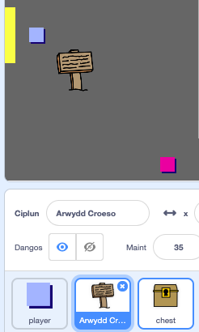
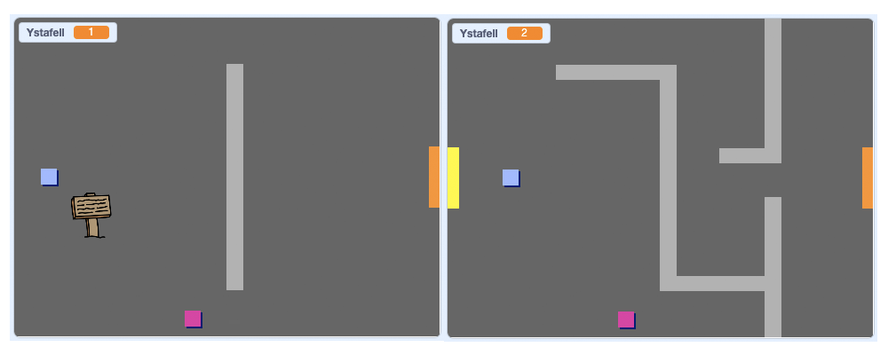
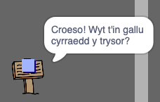

## Arwyddion

Fe awn ati i ychwanegu arwyddion i dy fyd i fod o gymorth i’r chwaraewr ar y daith.

Mae dy brosiect yn cynnwys corlun `arwydd croeso`:



\--- task \--- Fe ddylai'r `arwydd croeso` ond fod yn weledol yn ystafell 1, felly fe wnawn ni ychwanegu côd i’r arwydd i sicrhau fod hyn yn digwydd:

\--- hints \--- \--- hint \--- `Pan mae'r faner yn cael ei glicio`{:class="block3events"}, mewn dolen `am byth`{:class="block3control"} gwirio `os`{:class="block3control"} mai `ystafell 1`{:class="block3variables"} ac os felly `dangos `{:class="block3looks"} corlun `arwydd croeso` `fel arall`{:class="block3control"} `cuddio`{:class="block3looks"} y corlun. \--- /hint \--- \--- hint \--- Dyma'r blociau rwyt ti eu hangen:


```blocks3
<br />os <> yna 
  
fel arall
end

<(ystafell :: variables) = [1]>

cuddio

dangos

am byth
end

pan fo'r flag werdd yn cael ei glicio

```

\--- / hint \--- - hint \--- Dyma'r côd cyflawn:


```blocks3
pan fo'r flag werdd yn cael ei glicio
am byth 
  os <(ystafell :: variables) = [1]> yna 
    dangos
  fel arall 
    cuddio
  end
end
```

\--- /hint \--- \--- /hints \---

\--- /task \---

\--- task \--- Profa'r côd i weld dy `arwydd croeso` yn symud rhwng ystafelloedd. Fe ddylai'r arwydd ond fod yn weledol yn ystafell 1.

 \--- /task \---

\--- task \--- Nid yw arwydd yn dda iawn os nad yw'n dweud unrhyw beth! Ychwanega mwy o gôd i ddangos neges os yw yr `arwydd croeso` yn cyffwrdd y `chwaraewr`:


```blocks3
pan fo'r flag werdd yn cael ei glicio
am byth 
  os <(ystafell :: variables) = [1]> yna 
    dangos
  fel arall 
    cuddio
  end
  + os <cyffwrdd (player v) ? > yna 
  +   dweud [Croeso! Wyt t'in gallu cyrraedd y trysor?]
  + fel arall 
  +   dweud []
  + end
end
```

\--- /task \---

\--- task \--- Profa dy `arwydd croeso` eto. Fe ddylet ti nawr weld neges pan mae'r `chwaraewr` yn cyffwrdd yr `arwydd croeso`.

 \--- /task \---