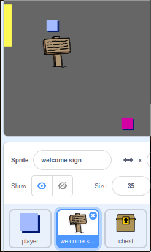
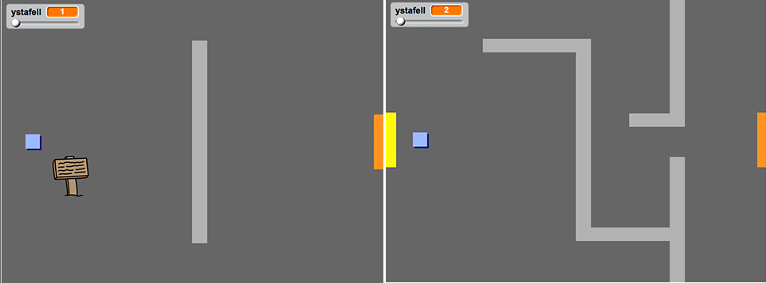
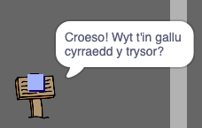

## Arwyddion

Fe awn ati i ychwanegu arwyddion i dy fyd i fod o gymorth i’r chwaraewr ar y daith.

Mae dy brosiect yn cynnwys corlun `arwydd croeso`:



\--- task \---

The `welcome sign` sprite should only be visible in room 1, so add some code to the sprite to make sure that this happens:

\--- hints \---

\--- hint \---

`When the flag is clicked`{:class="block3events"}, in a `forever`{:class="block3control"} loop, check `if`{:class="block3control"} the `room is 1`{:class="block3variables"} and in that case `show`{:class="block3looks"} `welcome sign` sprite, `else`{:class="block3control"} `hide`{:class="block3looks"} the sprite.

\--- /hint \---

\--- hint \---

Dyma'r blociau côd rwyt ti eu hangen:


```blocks3
<br />os <> yna 
  
fel arall
end

<(ystafell :: variables) = [1]>

cuddio

dangos

am byth
end

pan fo'r flag werdd yn cael ei glicio

```

\--- /hint \---

\--- hint \---

Here is the complete code:


```blocks3
pan fo'r flag werdd yn cael ei glicio
am byth 
  os <(ystafell :: variables) = [1]> yna 
    dangos
  fel arall 
    cuddio
  end
end
```

\--- /hint \---

\--- /hints \---

\--- /task \---

\--- task \---

Test the code for your `welcome sign` sprite by moving between rooms. Fe ddylai'r arwydd ond fod yn weledol yn ystafell 1.



\--- /task \---

\--- task \---

A sign isn't much good if it doesn't say anything! Ychwanega mwy o gôd i ddangos neges os yw yr `arwydd croeso` yn cyffwrdd y `chwaraewr`:


```blocks3
pan fo'r flag werdd yn cael ei glicio
am byth 
  os <(ystafell :: variables) = [1]> yna 
    dangos
  fel arall 
    cuddio
  end
  + os <cyffwrdd (player v) ? > yna 
  +   dweud [Croeso! Wyt t'in gallu cyrraedd y trysor?]
  + fel arall 
  +   dweud []
  + end
end
```

\--- /task \---

\--- task \---

Test your `welcome sign` sprite again. Fe ddylet ti nawr weld neges pan mae'r `chwaraewr` yn cyffwrdd yr `arwydd croeso`.



\--- /task \---