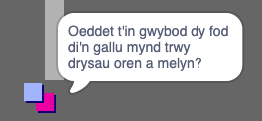

## Pobl

Fe awn ati i ychwanegu pobl arall i dy fyd mae modd i dy `chwaraewr` ryngweithio â nhw.

--- task --- Newida i'r corlun `person`.

 --- /task ---

--- task --- Ychwanega gôd i dy `person` fel fod y person yn siarad â'r `chwaraewr`. Mae'r côd yn derbyg iawn i'r un wnes di ei ychwanegu i'r `arwydd`:


```blocks3
pan fo'r flag werdd yn cael ei glicio
mynd i x: (0) y: (-150)
am byth 
  os <cyffwrdd (chwaraewr v) ? > yna 
    dweud [Oeddet ti'n gwybod dy fod di'n gallu mynd trwy drysau oren a melyn?]
  fel arall 
    dweud []
  end
end
```

--- /task ---

--- task --- Rho ganiatâd i'r `person` i symud trwy ychwanegu dau floc yn adran `fel arall`{:class="block3control"} dy gôd:


```blocks3
pan fo'r flag werdd yn cael ei glicio
mynd i x: (0) y: (-150)
am byth 
  os <cyffwrdd (chwaraewr v) ? > yna 
    dweud [Oeddet ti'n gwybod dy fod di'n gallu mynd trwy drysau oren a melyn?]
  fel arall 
    dweud []
    + symud (1) cam
    + os ar ymyl, bowndio
  end
end

```

--- /task ---

Bydd dy `berson` nawr yn symud, ond yn stopio i siarad gyda'r `chwaraewr`.



--- task --- Ychwanega gôd i dy `berson` newydd fel ei fod ond yn ymddangos yn ystafell 1. Fe ddylai'r côd fod union yr un peth â'r côd sydd yn gwneud i'r `arwydd` ymddangos yn ystafell 1.

Gwna'n siwr dy fod di'n profi dy gôd. --- /task ---