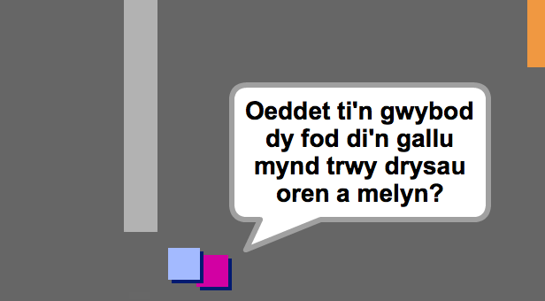

## Pobl

Fe awn ati i ychwanegu pobl arall i dy fyd mae modd i dy `chwaraewr` ryngweithio â nhw.

\--- task \---

Switch to the `person` sprite.


\--- /task \---

\--- task \---

Add some code to the `person` sprite so that the person talks to the `player` sprite. Mae'r côd yn derbyg iawn i'r un wnes di ei ychwanegu i'r `arwydd`:


```blocks3
pan fo'r flag werdd yn cael ei glicio
mynd i x: (0) y: (-150)
am byth 
  os <cyffwrdd (player v) ? > yna 
    dweud [Oeddet ti'n gwybod dy fod di'n gallu mynd trwy drysau oren a melyn?]
  fel arall 
    dweud []
  end
end
```

\--- /task \---

\--- task \---

Allow your `person` sprite to move by adding these two blocks in the `else`{:class="block3control"} section of your code:


```blocks3
pan fo'r flag werdd yn cael ei glicio
mynd i x: (0) y: (-150)
am byth 
  os <cyffwrdd (player v) ? > yna 
    dweud [Oeddet ti'n gwybod dy fod di'n gallu mynd trwy drysau oren a melyn?]
  fel arall 
    dweud []
    + symud (1) cam
    + os ar ymyl, bowndio
  end
end
```

\--- /task \---

Bydd dy `berson` nawr yn symud, ond yn stopio i siarad gyda'r `chwaraewr`.



\--- task \---

Add code to your new `person` sprite so that the sprite only appears in room 1. Fe ddylai'r côd fod union yr un peth â'r côd sydd yn gwneud i'r `arwydd` ymddangos yn ystafell 1.

Gwna'n siwr dy fod di'n profi dy gôd.

\--- /task \---