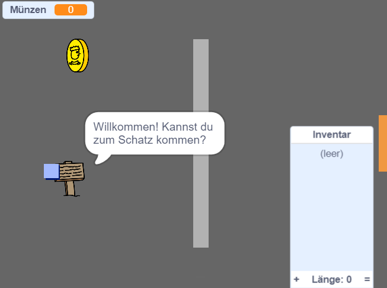

\--- no-print \---

This is the **Scratch 3** version of the project. There is also a [Scratch 2 version of the project](https://projects.raspberrypi.org/en/projects/create-your-own-world-scratch2).

\--- /no-print \---

## Einleitung

In this project, you'll learn how to create your own adventure game world with multiple levels to explore.

### Was du machen wirst

\--- no-print \---

Klicke zum Starten auf die grüne Flagge. Benutze die Pfeiltasten, um deinen Charakter in der Welt zu bewegen.

  <iframe allowtransparency="true" width="485" height="402" src="https://scratch.mit.edu/projects/embed/258757783/?autostart=false" frameborder="0" scrolling="no"></iframe>
  

\--- /no-print \---

\--- print-only \---

You'll use the arrow keys to move your character around in the world. 

\--- /print-only \---

## \--- collapse \---

## title: Was du brauchen wirst

### Hardware

- Ein Computer, auf dem Scratch 3 ausgeführt werden kann

### Software

- Scratch 3 (entweder [online](http://rpf.io/scratchon){:target="_blank"} oder [offline](http://rpf.io/scratchoff){:target="_blank"})

### Downloads

You can find everything you need to complete this project at [rpf.io/p/en/create-your-own-world-go](https://rpf.io/p/en/create-your-own-world-go).

\--- /collapse \---

## \--- collapse \---

## title: Was du lernen wirst

- Use conditional selection to react to key presses
- Use variables to store a game's state
- Use conditional selection based on the value of a variable
- Use lists to store data

\--- /collapse \---

## \--- collapse \---

## title: Additional information for educators

Wenn Sie dieses Projekt ausdrucken möchten, dann verwenden Sie bitte die [druckfreundliche Version](https://projects.raspberrypi.org/en/projects/create-your-own-world/print){: target = "_ blank"}.

You can find the [completed project here](https://rpf.io/p/en/create-your-own-world-get){:target="_blank"}.

\--- /collapse \---