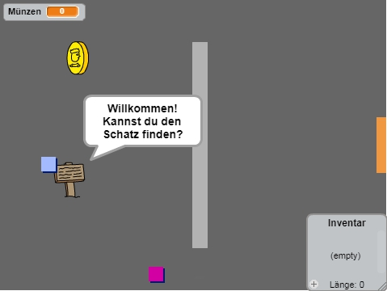

## Einleitung

In diesem Projekt lernst du, wie du dein eigenes Abenteuerspiel programmieren kannst - mit mehreren Räumen, die der Spieler erkunden kann.

### Was du machen wirst

Klicke zum Starten auf die grüne Flagge. Benutze die Pfeiltasten, um deinen Charakter in der Welt zu bewegen.

  <iframe allowtransparency="true" width="485" height="402" src="https://scratch.mit.edu/projects/embed/34248822/?autostart=false" frameborder="0"></iframe>
  

### Was du lernen wirst

Dieses Projekt umfasst Elemente aus den folgenden Themen des [Raspberry Pi Digital Making Curriculum](http://rpf.io/curriculum){:target="_blank"}:

+ [Kombinieren von grundlegenden Programmierstrukturen um ein Problem zu lösen.](https://www.raspberrypi.org/curriculum/programming/builder){:target="_blank"}

### Zusätzliche Informationen für Pädagogen

Wenn Sie dieses Projekt ausdrucken möchten, dann verwenden Sie bitte die [druckfreundliche Version](https://projects.raspberrypi.org/en/projects/create-your-own-world/print){: target = "_ blank"}.

Verwenden Sie den Link in der Fußzeile, um auf das GitHub-Repo für dieses Projekt zuzugreifen, wo alle Ressourcen (mit einem Beispiel für das abgeschlossene Projekt) im Ordner `en/resources` enthalten sind.