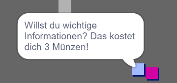

## Herausforderung: Erweitere deine Welt

Du kannst jetzt mit dem Bau deiner eigenen Welt weitermachen! Hier sind ein paar Vorschläge:

+ Füge deinem Spiel mehr Münzen, in verschiedenen Räumen, hinzu. Kannst Du einige Münzen von patrouillierenden Feinden bewachen lassen?
+ Ändere die Hintergründe deines Spiels
+ Füge deinem Spiel Töne und Musik hinzu
+ Füge mehr Menschen, Feinde und Schilder hinzu
+ Füge rote und gelbe Türen - und spezielle Schlüssel - hinzu, um sie zu öffnen
+ Füge deiner Welt mehr Zimmer hinzu
+ Füge dem Spiel weitere nützliche Gegenstände hinzu
    
    + Verwende Münzen, um Informationen von anderen Personen zu erhalten:



+ Du kannst sogar Türen in den nördlichen und südlichen Wänden von Zimmer 1 hinzufügen, so dass sich der Spieler in allen vier Richtungen zwischen den Zimmern bewegen kann. Zum Beispiel kann dein Spiel neun Räume in einem 3 × 3-Raster haben. Du kannst dann `3` zu der Zimmernummer addieren, um eine Ebene tiefer zu kommen.

 

```blocks3
falls <wird Farbe [ ] berührt?> , dann 
  wechsle zu Bühnenbild ((Kostüm [Nummer v]) + (3))
  gehe zu x: (0) y: (200)
  ändere [Raum v] um (3)
end
```