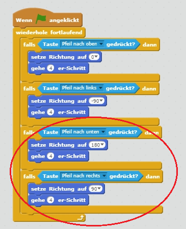

## Die Figur vom `Spieler` bewegen

Beginnen wir mit der Programmierung einer `Spieler`-Figur die sich in deiner Welt umher bewegen kann.

+ Wenn du Scratch online verwendest, öffne das Scratch-Projekt 'Erschaffe deine eigene Welt' hier: <http://jumpto.cc/world-go>{:target="_blank"}. Wenn Du Scratch offline verwendest, kannst du das Projekt [hier](http://jumpto.cc/world-get){:target="_blank"} herunterladen und es dann mit dem offline Editor öffnen. 


Die Person, die das Spiel spielt, bewegt die Figur des `Spielers` mit den Pfeiltasten herum. Wenn die Person den Pfeil nach oben drückt, musst du dem `Spieler` sagen, dass er mit einer Bewegung nach oben reagieren soll, so dass er sich in die richtige Richtung bewegt.

+ Füge diesen Code der Figur des `Spielers` hinzu:

```blocks
    Wenn die grüne Flagge angeklickt
wiederhole fortlaufend 
  falls <Taste [Pfeil nach oben v] gedrückt? > dann 
    setze Richtung auf (0)
    gehe (4) er-Schritt
  end
end
```

+ Test out your `player` sprite by clicking the flag and then holding down the up arrow. Does your `player` sprite move up?
    
    

+ To move the `player` sprite to the left, you need to add another `if`{:class="blockcontrol"} block with similar code to it:

```blocks
    when flag clicked
    forever
        if <key [up arrow v] pressed? > then
            point in direction (0)
            move (4) steps
        end
        if <key [left arrow v] pressed? > then
            point in direction (-90)
            move (4) steps
        end
    end
```

+ Add more code to your `player` sprite so that they can move down and right as well. Use the code you already have to help you.

\--- hints \--- \--- hint \--- To move up, you pointed the `player` sprite into the direction `0` degrees. What would you have to do to move the sprite down?

To move left, you pointed the sprite in the direction `-90` degrees. What would you have to do to move the sprite right? \--- /hint \--- \--- hint \--- You will need to change these two blocks:

```blocks
<key [ v] pressed>
```

```blocks
point in direction ()
```

Duplicate the code you have used to go up, but change these two blocks to make the `player` sprite move down. Do the same for moving right. \--- /hint \--- \--- hint \--- Here is how your code should look:

 \--- /hint \--- \--- /hints \---