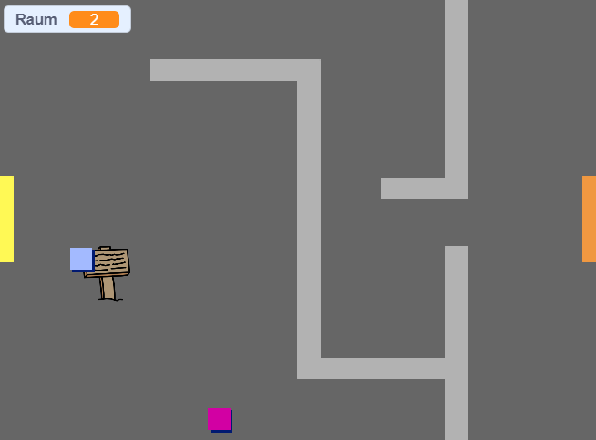

## Bewege dich in deiner Welt

Die `Spieler`-Figur sollte in der Lage sein, durch Türen in andere Räume zu gehen.

Dein Projekt enthält Bühnenbilder von weiteren Zimmern:


--- task ---

Erstelle eine neue Variable "für alle Figuren" mit dem Namen `Raum`{:class="block3variables"}, um festzuhalten, in welchem Raum die `Spieler`-Figur ist.

[[[generic-scratch3-add-variable]]]

 --- /task ---

--- task --- Wenn die `Spieler`-Figur die orangefarbene Tür im ersten Raum berührt, soll das nächste Bühnenbild angezeigt werden und die `Spieler`-Figur soll zurück zur linken Seite der Bühne bewegt werden. Füge diesen Code innerhalb der `wiederholen fortlaufend`{:class="block3control"}-Schleife deiner `Spieler`-Figur ein:


```blocks3
Wenn die grüne Flagge angeklickt
wiederhole fortlaufend 
  falls <Taste (Pfeil nach oben v) gedrückt?> , dann 
    setze Richtung auf (0) Grad
    gehe (4) er Schritt
  Ende
  falls <Taste (Pfeil nach links v) gedrückt?> , dann 
    setze Richtung auf (-90) Grad
    gehe (4) er Schritt
  Ende
    falls <Taste (Pfeil nach unten v) gedrückt?> , dann 
    setze Richtung auf (-180) Grad
    gehe (4) er Schritt
  Ende
    falls <Taste [Pfeil nach rechts v] gedrückt?> , dann 
    setze Richtung auf (90) Grad
    gehe (4) er Schritt
  Ende
  falls <wird Farbe [#BABABA] berührt?> , dann 
  gehe (-4) er Schritt
  Ende
+ falls <wird Farbe [#F2A24A] berührt?> , dann 
  wechsle zu Bühnenbild (nächstes Bühnenbild v)
  gehe zu x: (-200) y: (0)
  ändere [Raum v] um (1)
  Ende
Ende
```

--- /task ---

--- task --- Bei jedem Spielstart müssen Raum, Charakterposition und Hintergrund zurückgesetzt werden.

Füge Code am **Anfang** des Skripts deiner `Spieler`-Figur über der `fortlaufend wiederhole`{:class="block3control"}-Schleife hinzu, um alles wieder auf Anfang zu setzten, wenn die grüne Flagge angeklickt wird:

--- hints ---
 --- hint --- Wenn das Spiel beginnt:

+ Der Wert von `Raum`{:class="block3variables"} sollte auf `1`{:class="block3variables"} gesetzt werden
+ Das `Bühnenbild`{:class="block3looks"} sollte auf `Raum1`{:class="block3looks"} gesetzt werden
+ Die Position der `Spieler`-Figur sollte auf `x: -200 y: 0`{:class="block3motion"} gesetzt werden
--- /hint ---
 --- hint --- Hier sind die zusätzlichen Blöcke, die du benötigst:


```blocks3
gehe zu x: (-200) y: (0)

setze [Raum v] auf (1)

wechsle zu Bühnenbild (Raum1 v)
```

--- /hint --- --- hint --- So sollte dein fertiges Skript aussehen:


```blocks3
Wenn die grüne Flagge angeklickt
+setze [Raum v] auf (1)
+gehe zu x: (-200) y: (0)
+wechsle zu Bühnenbild (Raum1 v)
wiederhole fortlaufend 
  falls <Taste (Pfeil nach oben v) gedrückt?> , dann 
    setze Richtung auf (0) Grad
    gehe (4) er Schritt
  Ende
  falls <Taste (Pfeil nach links v) gedrückt?> , dann 
    setze Richtung auf (-90) Grad
    gehe (4) er Schritt
  Ende
    falls <Taste (Pfeil nach unten v) gedrückt?> , dann 
    setze Richtung auf (-180) Grad
    gehe (4) er Schritt
  Ende
    falls <Taste [Pfeil nach rechts v] gedrückt?> , dann 
    setze Richtung auf (90) Grad
    gehe (4) er Schritt
  Ende
  falls <wird Farbe [#BABABA] berührt?> , dann 
  gehe (-4) er Schritt
  Ende
  falls <wird Farbe [#F2A24A] berührt?> , dann 
  wechsle zu Bühnenbild (nächstes Bühnenbild v)
  gehe zu x: (-200) y: (0)
  ändere [Raum v] um (1)
  Ende
Ende
```

--- /hint ------ /hints ---

--- /task ---

--- task --- Klicke auf die Flagge und bewege dann deine `Spieler`-Figur bis sie die orange Tür berührt. Bewegt sich deine Figur zum nächsten Zimmer? Ändert sich die Variable `Raum`{:class="block3variables"} zu `2`?

 --- /task ---