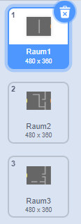

## Schilder

Die `Spieler`-Figur sollte in der Lage sein, durch Türen in andere Räume zu gehen.

Dein Projekt enthält Bühnenbilder von weiteren Zimmern:



\--- task \---

Erstelle eine neue Variable "für alle Figuren" mit dem Namen `Raum`{:class="block3variables"}, um festzuhalten, in welchem Raum die `Spieler`-Figur ist.

[[[generic-scratch3-add-variable]]]


\--- /task \---

\--- task \---

When the `player` sprite touches the orange door in the first room, the game should display the next backdrop, and the `player` sprite should move back to the left side of the Stage. Add this code inside the `player` sprite's `forever`{:class="block3control"} loop:


```blocks3
Wenn die grüne Flagge angeklickt
wiederhole fortlaufend 
  falls <Taste (Pfeil nach oben v) gedrückt?> , dann      setze Richtung auf (0) Grad
    gehe (4) er Schritt
  end
  falls <Taste (Pfeil nach links v) gedrückt?> , dann      setze Richtung auf (-90) Grad
    gehe (4) er Schritt
  end
  falls <Taste (Pfeil nach unten v) gedrückt?> , dann      setze Richtung auf (-180) Grad
    gehe (4) er Schritt
  end
  falls <Taste [Pfeil nach rechts v] gedrückt?> , dann      setze Richtung auf (90) Grad
    gehe (4) er Schritt
  end
  + falls <wird Farbe [#BABABA] berührt?> , dann    +   gehe (-4) er Schritt
  + end
  + falls <wird Farbe [#F2A24A] berührt?> , dann 
  +   wechsle zu Bühnenbild (nächstes Bühnenbild v)
  +   gehe zu x: (-200) y: (0)
  +   ändere [Raum v] um (1)
  + end
end
```

\--- /task \---

\--- task \---

Every time the game starts, the room, character position, and backdrop need to be reset.

Add code to the **start** of your `player` sprite code above the `forever`{:class="block3control"} loop, to reset everything when the flag is clicked:

\--- hints \---

\--- hint \---

When the game starts:

+ Der Wert von `Raum` {:class="block3variables"} sollte auf `1`{:class="block3variables"} gesetzt werden
+ Das `Bühnenbild`{:class="block3look"} sollte auf `Raum1`{:class="block3look"} gesetzt werden
+ The position of the `player` sprite should be set to `x: -200 y: 0`{:class="block3motion"}

\--- /hint \---

\--- hint \---

Here are the extra blocks you need:


```blocks3
gehe zu x: (-200) y: (0)

setze [Raum v] auf (1)

wechsle zu Bühnenbild (Raum1 v)
```

\--- /hint \---

\--- hint \---

Here's what your finished script should look like:


```blocks3
Wenn die grüne Flagge angeklickt
+setze [Raum v] auf (1)
+gehe zu x: (-200) y: (0)
+wechsle zu Bühnenbild (Raum1 v)
wiederhole fortlaufend 
  falls <Taste (Pfeil nach oben v) gedrückt?> , dann      setze Richtung auf (0) Grad
    gehe (4) er Schritt
  end
  falls <Taste (Pfeil nach Links v) gedrückt?> , dann      setze Richtung auf (-90) Grad
    gehe (4) er Schritt
  end
  falls <Taste (Pfeil nach unten v) gedrückt?> , dann      setze Richtung auf (-180) Grad
    gehe (4) er Schritt
  end
  falls <Taste [Pfeil nach rechts v] gedrückt?> , dann     setze Richtung auf (90) Grad
    gehe (4) er Schritt
  end
  falls <wird Farbe [#BABABA] berührt?> , dann      gehe (-4) er Schritt
  end
  falls <wird Farbe [#F2A24A] berührt?> , dann 
    wechsle zu Bühnenbild (nächstes Bühnenbild v)
    gehe zu x: (-200) y: (0)
    ändere [Raum v] um (1)
  end
end
```

\--- /hint \---

\--- /hints \---

\--- /task \---

\--- task \---

Click the flag, and then move your `player` sprite until it touches the orange door. Does the sprite move to the next screen? Does the `room`{:class="block3variables"} variable change to `2`?


\--- /task \---