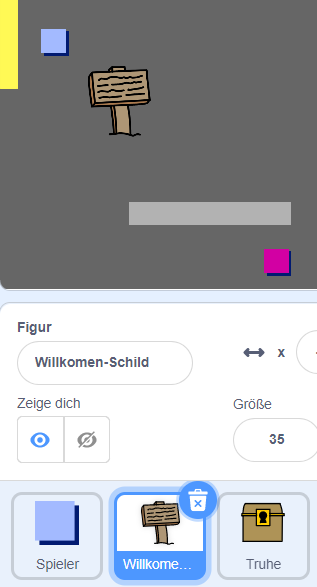
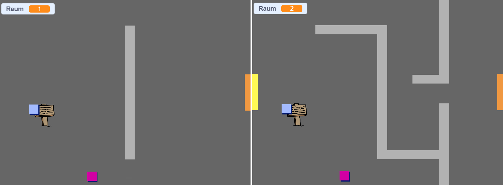
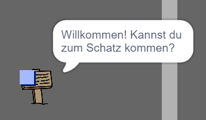

## Schilder

Stelle jetzt Schilder in deiner Welt auf, um den Spieler auf seiner Reise zu leiten.

Dein Projekt enthält die Figur von einem `Willkommen-Schild`:



--- task --- Das `Willkommen-Schild` sollte nur im Raum 1 sichtbar sein. Füge Code zur Figur hinzu, um sicherzustellen, dass dies geschieht:

--- hints ---
 --- hint --- `Wenn die grüne Flagge angeklickt wird`{:class="block3events"}, prüfe in einer `wiederhole fortlaufend`{:class="block3control"}-Schleife, und `falls`{:class="block3control"} der `Raum = 1`{:class="block3variables"} ist `zeige`{:class="block3looks"} die `Willkomen-Schild`-Figur, `sonst`{:class="block3control"} `verstecke`{:class="block3looks"} die Figur.
--- /hint ---
 --- hint --- Hier sind die Code Blöcke die du brauchst:


```blocks3
falls <> , dann 
  
sonst

<(Raum :: variables) = [1]>

verstecke dich

zeige dich

wiederhole fortlaufend

Wenn die grüne Flagge angeklickt

```

--- /hint --- --- hint --- Hier ist der vollständige Code:


```blocks3
Wenn die grüne Flagge angeklickt
wiederhole fortlaufend 
  falls <(Raum :: variables) = [1]> , dann 
    zeige dich
  sonst 
    verstecke dich
```

--- /hint ------ /hints ---

--- /task ---

--- task --- Prüfe den Code deiner `Willkommen-Schild`-Figur indem du dich zwischen den Räumen bewegst. Das Schild sollte nur in Raum 1 sichtbar sein.

 --- /task ---

--- task --- Ein Schild nützt nicht viel, wenn nichts darauf steht! Füge weiteren Code hinzu um eine Nachricht anzuzeigen, wenn das `Willkommen-Schild` vom `Spieler` berührt wird:


```blocks3
Wenn die grüne Flagge angeklickt
wiederhole fortlaufend 
falls <(Raum :: variables) = [1]> , dann 
zeige dich
sonst 
verstecke dich
+ falls <wird (Spieler v) berührt?> , dann 
sage [Willkommen! Kannst du zum Schatz kommen?]
sonst 
sage []
```

--- /task ---

--- task --- Teste deine `Willkommen-Schild`-Figur erneut. Du solltest nun eine Nachricht sehen, wenn deine `Spieler`-Figur die `Willkommen-Schild`-Figur berührt.

 --- /task ---