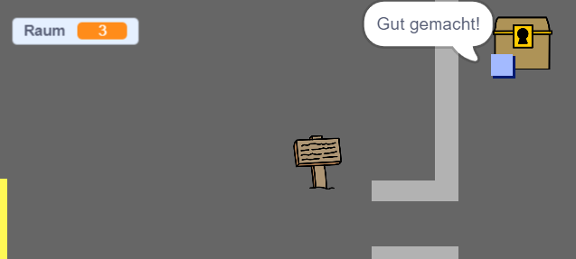

## Herausforderung: Der Schatz!

Kannst du einen Schatz hinzufügen, damit er vom Spieler gefunden wird?

Lass die `Schatz-Truhe`-Figur nur in Raum 3 erscheinen und lass sie "Gut gemacht!" sagen, wenn die `Spieler`-Figur sie berührt.

