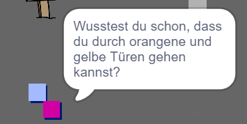

## Personen

Lass uns ein paar Personen in deine Welt setzen, mit denen dein `Spieler` in interagieren kann.

--- task --- Wechsle zur Figur `Person`.

 --- /task ---

--- task --- Füge Code zur Figur `Person` hinzu, sodass die Person mit dem `Spieler` spricht. Dieser Code ist dem Code, den du bereits zum `Schild` hinzugefügt hast, sehr ähnlich:


```blocks3
Wenn die grüne Flagge angeklickt
gehe zu x: (0) y: (-150)
wiederhole fortlaufend 
  falls <wird (Spieler v) berührt?> , dann 
    sage [Wusstest du schon, dass du durch orangene und gelbe Türen gehen kannst?]
  sonst 
    sage []
```

--- /task ---

--- task --- Erlaube deiner `Person`-Figur sich zu bewegen, indem du diese beiden Blöcke in den `sonst`{:class="block3control"} Abschnitt deines Codes einfügst:


```blocks3
Wenn die grüne Flagge angeklickt
gehe zu x: (0) y: (-150)
wiederhole fortlaufend 
    falls <wird (Spieler v) berührt?> , dann 
      sage [Wusstest du schon, dass du durch orangene und gelbe Türen gehen kannst?]
    sonst 
      sage []
+     gehe (1) er Schritt
+     pralle vom Rand ab
    Ende
Ende
```

--- /task ---

Die `Person` bewegt sich jetzt hin und her, bleibt aber stehen, um mit dem `Spieler` zu sprechen.



---task --- Füge Code zu deiner neuen `Person`-Figur hinzu, so dass diese nur in Raum 1 erscheint. Der Code, den du benötigst, ist genau der gleiche wie der Code, der die `Schild`-Figur nur in Raum 1 sichtbar macht.

Vergiss nicht, den neuen Code zu testen. --- /task ---