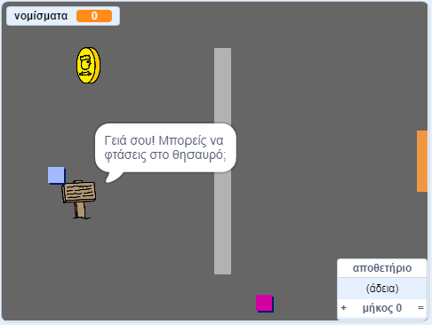

--- no-print ---

Αυτή είναι η **Scratch 3** έκδοση του έργου. Υπάρχει επίσης η [Scratch 2 έκδοση του έργου](https://projects.raspberrypi.org/el-GR/projects/create-your-own-world-scratch2).

--- /no-print ---

## Εισαγωγή

Σ' αυτό το έργο, θα μάθεις πώς να δημιουργείς τον δικό σου κόσμο σε παιχνίδι περιπέτειας, με πολλαπλά επίπεδα εξερεύνησης.

### Τι θα δημιουργήσεις

--- no-print ---

Πάτα στην πράσινη σημαιούλα για να ξεκινήσεις. Χρησιμοποίησε τα βελάκια στο πληκτρολόγιο για να μετακινήσεις το χαρακτήρα σου στον κόσμο.

  <iframe allowtransparency="true" width="485" height="402" src="https://scratch.mit.edu/projects/embed/258757783/?autostart=false" frameborder="0" scrolling="no"></iframe>
  

--- /no-print ---

--- print-only ---

Θα χρησιμοποιήσεις τα βελάκια στο πληκτρολόγιο για να μετακινήσεις το χαρακτήρα σου στον κόσμο. 

--- /print-only ---

--- collapse ---
---
title: Τι θα χρειαστείς
---

### Υλικό

- Ένας υπολογιστής ικανός να τρέχει το Scratch 3

### Λογισμικό

- Scratch 3 (είτε [online](http://rpf.io/scratchon){:target="_blank"} είτε [offline](http://rpf.io/scratchoff){:target="_blank"})

### Λήψεις

Μπορείς να βρεις όλα όσα χρειάζεσαι για να ολοκληρώσεις αυτό το έργο στο [rpf.io/p/el-GR/create-your-own-world-go](https://rpf.io/p/el-GR/create-your-own-world-go).

--- /collapse ---

--- collapse ---
---
title: Τι θα μάθεις
---

- Χρησιμοποίησε την επιλογή υπό προϋποθέσεις για να αντιδράς στο πάτημα ενός πλήκτρου
- Χρησιμοποίησε μεταβλητές για να αποθηκεύσεις την κατάσταση ενός παιχνιδιού
- Χρησιμοποίησε την επιλογή υπό προϋποθέσεις με βάση την τιμή μιας μεταβλητής
- Χρησιμοποίησε λίστες για την αποθήκευση δεδομένων

--- /collapse ---

--- collapse ---
---
title: Πρόσθετες πληροφορίες για εκπαιδευτικούς
---

Αν χρειαστεί να εκτυπώσεις αυτό το έργο, χρησιμοποίησε την [εκτυπώσιμη έκδοση](https://projects.raspberrypi.org/el-GR/projects/create-your-own-world/print){:target="_blank"}.

Μπορείς να βρεις [το ολοκληρωμένο έργο εδώ](https://rpf.io/p/el-GR/create-your-own-world-get){:target="_blank"}.

--- /collapse ---