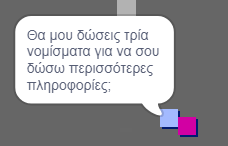
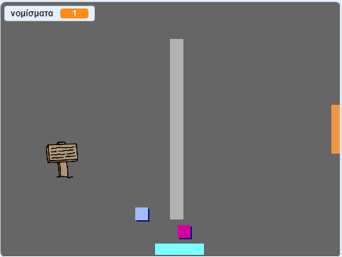

## Πρόκληση: Επέκτεινε τον κόσμο σου

Τώρα μπορείς να συνεχίσεις να δημιουργείς τον δικό σου κόσμο! Ακολουθούν μερικές ιδέες:

+ Πρόσθεσε περισσότερα νομίσματα στο παιχνίδι σε διαφορετικές αίθουσες. Μπορείς να αφήσεις κάποια νομίσματα να τα φυλάνε οι εχθροί;
+ Άλλαξε τα υπόβαθρα του παιχνιδιού
+ Πρόσθεσε ήχους και μουσική στο παιχνίδι σου
+ Πρόσθεσε και άλλα άτομα, εχθρούς και σημάδια
+ Πρόσθεσε κόκκινες και κίτρινες πόρτες και ειδικά κλειδιά για να τις ανοίγεις
+ Πρόσθεσε επιπλέον αίθουσες στον κόσμο σου
+ Πρόσθεσε διάφορα χρήσιμα στοιχεία στο παιχνίδι σου
    
    + Χρησιμοποίησε νομίσματα για να αγοράζεις πληροφορίες από άλλους ανθρώπους:



+ Θα μπορούσες ακόμα να προσθέσεις πόρτες στον βόρειο και στο νότιο τοίχο της αίθουσας 1, έτσι ώστε ο παίκτης να μπορεί να μετακινηθεί μεταξύ των αιθουσών και στις τέσσερις κατευθύνσεις. Για παράδειγμα, το παιχνίδι σου μπορεί να έχει εννέα αίθουσες σε ένα πλέγμα 3 × 3. Στη συνέχεια, μπορείς να προσθέσεις ` 3 ` στον αριθμό αίθουσας για να μετακινηθείς ένα επίπεδο κάτω.

 

```blocks3
εάν <touching color [ ]?> τότε
άλλαξε υπόβαθρο σε ((ενδυμασία [number v]) + (3))
πήγαινε σε θέση x:(0) y:(200)
άλλαξε [αίθουσα v] κατά (3)
```