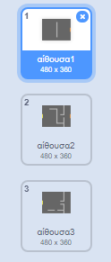
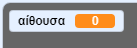
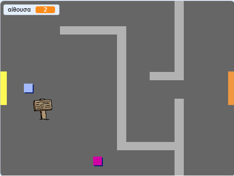

## Περιηγήσου στον κόσμο σου

Το αντικείμενο `παίκτης` θα πρέπει να είναι σε θέση να περάσει μέσα από τις πόρτες σε άλλες αίθουσες.

Το έργο περιέχει υπόβαθρα σκηνής για επιπλέον αίθουσες:



\--- task \---

Δημιούργησε μια νέα 'Για όλα τα αντικείμενα' μεταβλητή με το όνομα `αίθουσα`{:class="block3variables"} για να καταγράφει τον αριθμό της αίθουσας στην οποία βρίσκεται ο `παίκτης`.

[[[generic-scratch3-add-variable]]]

 \--- /task \---

\--- task \--- Όταν το αντικείμενο `παίκτης` αγγίξει την πορτοκαλί πόρτα στην πρώτη αίθουσα, θα πρέπει να εμφανιστεί το επόμενο υπόβαθρο σκηνής και ο `παίκτης` θα πρέπει να μετακινηθεί πίσω στην αριστερή πλευρά της σκηνής. Πρόσθεσε αυτόν τον βρόγχο επανάληψης μέσα στο αντικείμενο `παίκτης` `για πάντα`{:class="block3control"}:


```blocks3
when flag clicked
forever
    if <key (up arrow v) pressed? > then
        point in direction (0)
        move (4) steps
    end
    if <key (left arrow v) pressed? > then
        point in direction (-90)
        move (4) steps
    end
        if <key (down arrow v) pressed? > then
        point in direction (-180)
        move (4) steps
    end
        if <key [right arrow v] pressed? > then
        point in direction (90)
        move (4) steps
    end
    if < touching color [#BABABA]? > then
    move (-4) steps
    end
+   if < touching color [#F2A24A] > then
    switch backdrop to (next backdrop v)
    go to x: (-200) y: (0)
    change [room v] by (1)
    end
end
```

\--- /task \---

\--- task \--- Κάθε φορά που ξεκινάει το παιχνίδι, πρέπει να ρυθμίζεται ξανά η αίθουσα, η θέση του αντικειμένου και το υπόβαθρο σκηνής.

Add code to the **start** of your `player` sprite code above the `forever`{:class="block3control"} loop, to reset everything when the flag is clicked:

\--- hints \--- \--- hint \--- When the game starts:

+ The value of `room`{:class="block3variables"} should be set to `1`{:class="block3variables"}
+ The `backdrop`{:class="block3looks"} should be set to `room1`{:class="block3looks"}
+ The position of the `player` sprite should be set to `x: -200 y: 0`{:class="block3motion"} \--- /hint \--- \--- hint \--- Here are the extra blocks you need:


```blocks3
go to x: (-200) y: (0)

set [room v] to (1)

switch backdrop to (room1 v)
```

\--- /hint \--- \--- hint \--- Here's what your finished script should look like:


```blocks3
when flag clicked
+set [room v] to (1)
+go to x: (-200) y: (0)
+switch backdrop to (room1 v)
forever
    if <key (up arrow v) pressed? > then
        point in direction (0)
        move (4) steps
    end
    if <key (left arrow v) pressed? > then
        point in direction (-90)
        move (4) steps
    end
        if <key (down arrow v) pressed? > then
        point in direction (-180)
        move (4) steps
    end
        if <key [right arrow v] pressed? > then
        point in direction (90)
        move (4) steps
    end
    if < touching color [#BABABA]? > then
    move (-4) steps
    end
    if < touching color [#F2A24A] > then
    switch backdrop to (next backdrop v)
    go to x: (-200) y: (0)
    change [room v] by (1)
end
end
```

\--- /hint \--- \--- /hints \---

\--- /task \---

\--- task \--- Click the flag, and then move your `player` sprite until it touches the orange door. Does the sprite move to the next screen? Does the `room`{:class="block3variables"} variable change to `2`?

 \--- /task \---