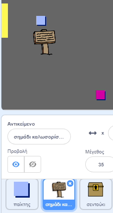
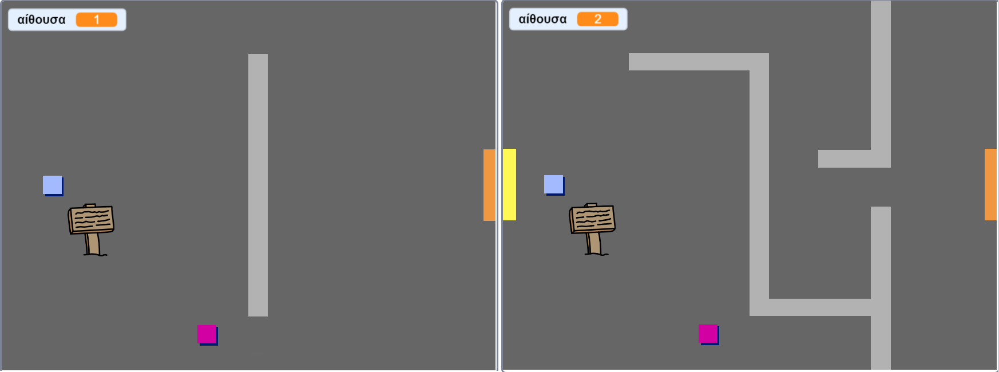
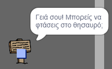

## Σημάδια

Ας προσθέσουμε σημάδια στον κόσμο μας που θα καθοδηγούν τους παίκτες στο ταξίδι τους.

Το έργο περιλαμβάνει ένα `σημάδι καλωσορίσματος`:



\--- task \--- Το ` σημάδι καλωσορίσματος` θα πρέπει να είναι ορατό μονάχα στην αίθουσα 1, έτσι θα πρέπει να προσθέσεις κώδικα στο αντικείμενο αυτό, προκειμένου να βεβαιωθείς πως αυτό επιτυγχάνεται:

\--- hints \--- \--- hint \--- `Όταν η σημαία πατηθεί`{:class="block3events"}, μέσα σε ένα `για πάντα`{:class="block3control"} βρόγχο επανάληψης, έλεγξε `εάν`{:class="block3control"} η `αίθουσα έχει τιμή 1`{:class="block3variables"} και τότε `εμφάνισε` το {:class="block3looks"} `σημάδι καλωσορίσματος`, `διαφορετικά`{:class="block3control"} `εξαφάνισε`{:class="block3looks"} το αντικείμενο. \--- /hint \--- \--- hint \--- Εδώ είναι τα μπλοκ εντολών που θα χρειαστείς:


```blocks3
<br />εάν &lt; &gt; τότε
αλλιώς
end

&lt; (αίθουσα :: variables) = [1] &gt;

εξαφάνισε

εμφάνισε

για πάντα
end

Όταν στην πράσινη σημαία γίνει κλικ

```

\--- /hint \--- \--- hint \--- Εδώ είναι ο κώδικας ολοκληρωμένος:


```blocks3
όταν στην πράσινη σημαία γίνει κλικ
για πάντα
   εάν < (αίθουσα :: variables) = [1] > τότε
        εμφάνισε
    αλλιώς
        εξαφάνισε
    end
end
```

\--- /hint \--- \--- /hints \---

\--- /task \---

\--- task \--- Κάνε έλεγχο στον κώδικά σου μετακινώντας το αντικείμενο `σημάδι καλωσορίσματος` μεταξύ των αιθουσών. Το σημάδι θα πρέπει να είναι ορατό μονάχα στην αίθουσα 1.

 \--- /task \---

\--- task \--- Ένα σημάδι δεν είναι πολύ καλό αν δεν λέει τίποτα! Πρόσθεσε επιπλέον κώδικα για να εμφανίζεται ένα μήνυμα όταν το `σημάδι καλωσορίσματος` αγγίξει το αντικείμενο `παίκτης`:


```blocks3
όταν στην πράσινη σημαία γίνει κλικ
για πάντα
εάν < (αίθουσα :: variables) = [1] > τότε
εμφάνισε
αλλιώς
εξαφάνισε
end
+εάν < αγγίζει (παίκτης v)? > τότε
πες [Γειά σου! Μπορείς να φτάσεις στο θησαυρό;]
αλλιώς
πες []
end
end
```

\--- /task \---

\--- task \--- Κάνε ξανά έλεγχο στο αντικείμενο `σημάδι καλωσορίσματος`. Θα πρέπει τώρα να βλέπεις ένα μήνυμα όταν ο `παίκτης` αγγίζει το `σημάδι καλωσορίσματος`.

 \--- /task \---