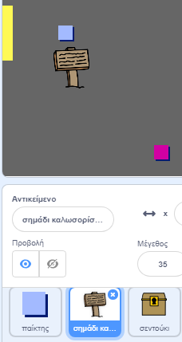
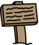
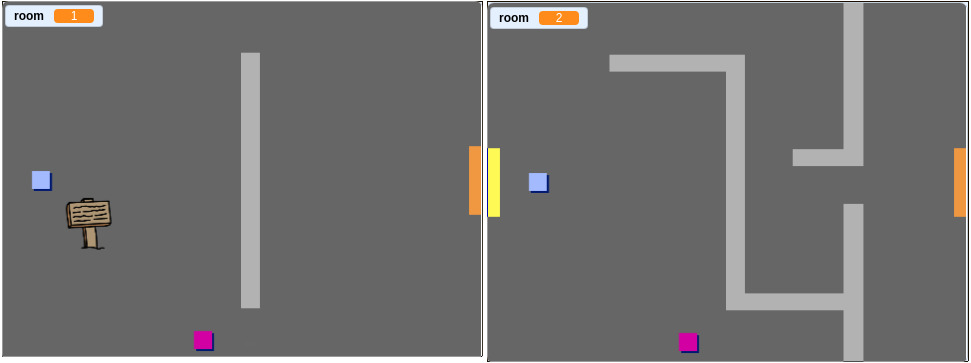
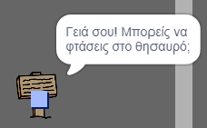

## Σημάδια

Ας προσθέσουμε σημάδια στον κόσμο μας που θα καθοδηγούν τους παίκτες στο ταξίδι τους.

Το έργο περιλαμβάνει ένα `σημάδι καλωσορίσματος`:



\--- task \---

Το `σημάδι καλωσορίσματος` θα πρέπει να είναι ορατό μονάχα στην αίθουσα 1, έτσι θα πρέπει να προσθέσεις κώδικα στο αντικείμενο αυτό, προκειμένου να βεβαιωθείς πως αυτό επιτυγχάνεται:

\--- hints \---

\--- hint \---

`When the flag is clicked`{:class="block3events"}, in a `forever`{:class="block3control"} loop, check `if`{:class="block3control"} the `room is 1`{:class="block3variables"} and in that case `show`{:class="block3looks"} `welcome sign` sprite, `else`{:class="block3control"} `hide`{:class="block3looks"} the sprite.

\--- /hint \---

\--- hint \---

Εδώ είναι τα μπλοκ που χρειάζεστε:



```blocks3
<br />εάν < > τότε
αλλιώς
end

< (αίθουσα :: variables) = [1] >

εξαφάνισε

εμφάνισε

για πάντα
end

Όταν στην πράσινη σημαία γίνει κλικ

```

\--- /hint \---

\--- hint \---

Here is the complete code:


```blocks3
όταν στην πράσινη σημαία γίνει κλικ
για πάντα
   εάν < (αίθουσα :: variables) = [1] > τότε
        εμφάνισε
    αλλιώς
        εξαφάνισε
    end
end
```

\--- /hint \---

\--- /hints \---

\--- /task \---

\--- task \---

Test the code for your `welcome sign` sprite by moving between rooms. Το σημάδι θα πρέπει να είναι ορατό μονάχα στην αίθουσα 1.



\--- /task \---

\--- task \---

A sign isn't much good if it doesn't say anything! Πρόσθεσε επιπλέον κώδικα για να εμφανίζεται ένα μήνυμα όταν το `σημάδι καλωσορίσματος` αγγίξει το αντικείμενο `παίκτης`:


```blocks3
όταν στην πράσινη σημαία γίνει κλικ
για πάντα
εάν < (αίθουσα :: variables) = [1] > τότε
εμφάνισε
αλλιώς
εξαφάνισε
end
+εάν < αγγίζει (παίκτης v)? > τότε
πες [Γειά σου! Μπορείς να φτάσεις στο θησαυρό;]
αλλιώς
πες []
end
end
```

\--- /task \---

\--- task \---

Test your `welcome sign` sprite again. Θα πρέπει τώρα να βλέπεις ένα μήνυμα όταν ο `παίκτης` αγγίζει το `σημάδι καλωσορίσματος`.



\--- /task \---