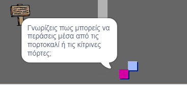

## Άτομα

Βάλε και άλλα άτομα στον κόσμο σου με τα οποία ο `παίκτης` θα μπορεί να αλληλεπιδρά.

\--- task \---

Switch to the `person` sprite.


\--- /task \---

\--- task \---

Add some code to the `person` sprite so that the person talks to the `player` sprite. This code is very similar to the code you added to your `sign` sprite:


```blocks3
όταν στην πράσινη σημαία γίνει κλικ
πήγαινε σε θέση x: (0) y: (-150)
για πάντα
    εάν < αγγίζει (παίκτης v)? > τότε
        πες [Γνωρίζεις πως μπορείς να περάσεις μέσα από τις πορτοκαλί ή τις κίτρινες πόρτες;]
    αλλιώς
        πες []
    end
end
```

\--- /task \---

\--- task \---

Allow your `person` sprite to move by adding these two blocks in the `else`{:class="block3control"} section of your code:


```blocks3
όταν πράσινη σημαία γίνει κλικ
πήγαινε σε θέση x: (0) y: (-150)
για πάντα
   εάν< αγγίζει (παίκτης v)? > τότε
        πες [Γνωρίζεις πως μπορείς να περάσεις μέσα από τις πορτοκαλί ή τις κίτρινες πόρτες;]
    αλλιώς
        πες []
+       κινήσου(1) βήματα
+       εάν σε όριο, αναπήδησε
    end
end
```

\--- /task \---

Your `person` sprite will now move, but will stop to talk to the `player` sprite.



\--- task \---

Add code to your new `person` sprite so that the sprite only appears in room 1. The code you need is exactly the same as the code that makes the `sign` sprite only visible in room 1.

Make sure you test out your new code.

\--- /task \---