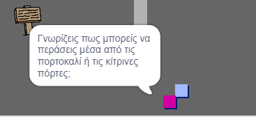

## Άτομα

Βάλε και άλλα άτομα στον κόσμο σου με τα οποία ο `παίκτης` θα μπορεί να αλληλεπιδρά.

\--- task \---

Πήγαινε στο αντικείμενο `Άτομο`.


\--- /task \---

\--- task \---

Add some code to the `person` sprite so that the person talks to the `player` sprite. Αυτός ο κώδικας είναι παρόμοιος με τον κώδικα που πρόσθεσες στο αντικείμενο `σημάδι`:


```blocks3
όταν στην πράσινη σημαία γίνει κλικ
πήγαινε σε θέση x: (0) y: (-150)
για πάντα
    εάν < αγγίζει (παίκτης v)? > τότε
        πες [Γνωρίζεις πως μπορείς να περάσεις μέσα από τις πορτοκαλί ή τις κίτρινες πόρτες;]
    αλλιώς
        πες []
    end
end
```

\--- /task \---

\--- task \---

Κάνε το `Άτομο` να μετακινείται προσθέτοντας αυτά τα δύο μπλοκ εντολών μέσα στο τμήμα `αλλιώς`{:class="block3control"} του κώδικα:


```blocks3
όταν πράσινη σημαία γίνει κλικ
πήγαινε σε θέση x: (0) y: (-150)
για πάντα
   εάν< αγγίζει (παίκτης v)? > τότε
        πες [Γνωρίζεις πως μπορείς να περάσεις μέσα από τις πορτοκαλί ή τις κίτρινες πόρτες;]
    αλλιώς
        πες []
+       κινήσου(1) βήματα
+       εάν σε όριο, αναπήδησε
    end
end
```

\--- /task \---

Τώρα το `Άτομο` θα μετακινηθεί αλλά θα σταματήσει για να μιλήσει με τον `παίκτη`.



\--- task \---

Add code to your new `person` sprite so that the sprite only appears in room 1. Ο κώδικας που χρειάζεσαι είναι ακριβώς ο ίδιος με αυτόν που έκανε το αντικείμενο `σημάδι` να είναι ορατό μονάχα στην αίθουσα 1.

Σιγουρέψου πως έλεγξες το νέο σου κώδικα.

\--- /task \---