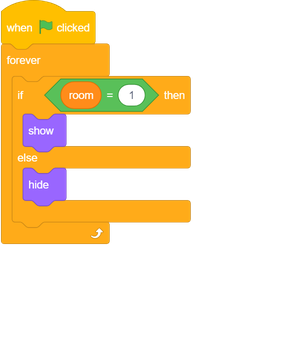
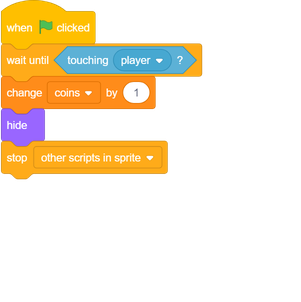

## Collect coins

Your `player` sprite should have be able to collect coins as it moves through the world.

--- task ---
Add a new variable valled `coins`{:class="block3variables"} to your project.
--- /task ---

--- task ---
Right-click on the `coin` sprite and choose **show**.

--- /task ---

--- task ---
Add code to your `coin` sprite so that it only appears in room 1.

--- /task ---

--- task ---

Add code to your `coin` sprite so that the sprite `hides`{:class="block3looks"} and `1`{:class="block3variables"} is added to the `coins`{:class="block3variables"} variable once the `player` sprite touches the `coin` sprite to 'pick it up'.

The code `stop other scripts in sprite`{:class="block3control"} is needed so that the `coin` sprite stops being displayed in room 1 once it's been collected.

--- /task ---

--- task ---
Now add code to the Stage to set your `coins`{:class="block3variables"} variable to `0`{:class="block3variables"} at the start of the game.

--- /task ---

--- task ---
Test your game. Collecting a coin should change your `coins` score to `1`{:class="block3variables"}.
--- /task ---

