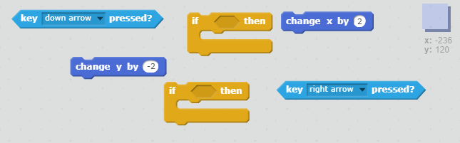
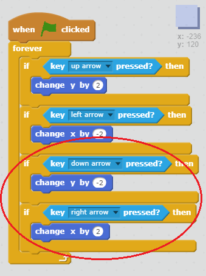

## Moving the player

Let's start by creating a player that can move around your world.

+ Open the 'Create Your Own World' Scratch project online at [http://jumpto.cc/world-go](http://jumpto.cc/world-go){:target="_blank"} or download from [http://jumpto.cc/world-get](http://jumpto.cc/world-get){:target="_blank"} and then open if you are using the offline editor.


The player will use the arrow keys to move around. When the player presses the up arrow, you want the player sprite to move up, by changing its y coordinate.

+ Add this code to the `player` sprite:

```blocks
	when flag clicked
	forever
		if <key [up arrow v] pressed? > then
			change y by (2)
		end
	end
```

+ Test out your player by clicking the flag and then holding down the up arrow. Does your player move up?

	

+ To move the player to the left, you need to add another `if`{:class="blockcontrol"} block to your player, which changes the x coordinate:

	```blocks
		when flag clicked
		forever
			if <key [up arrow v] pressed? > then
				change y by (2)
			end
			if <key [left arrow v] pressed? > then
				change x by (-2)
			end
		end
	```

--- challenge ---
+ Add more code to your player sprite so that they can move down and right as well. Use the code you already have to help you.

--- hints ---
--- hint ---
To move up, you change y by 2. This means you add on 2 to the y coordinate of the player. What would you have to do to the y coordinate to move the player down?

To move left, you change x by -2. This means you take away 2 from the x coordinate of the player. What would you have to do to the x coordinate to move the player right?
--- /hint ---
--- hint ---
Here are the blocks you will need to be able to move down and right


--- /hint ---
--- hint ---
Here is how your code should look:


--- /hint ---
--- /hints ---

--- /challenge ---
