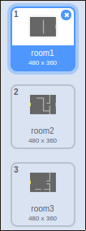

## Coding your world

Let's allow the player sprite to walk through doors into other rooms.

Your project contains backdrops for additional rooms:



+ Create a new 'for all sprites' variable called `room`{:class="blockdata"}, to keep track of which room the player sprite is in.

[[[generic-scratch-add-variable]]]


+ When the player sprite touches the orange door in the first room, the next backdrop should be displayed, and the player sprite should move back to the left side of the stage. Add this code inside the player sprite's `forever`{:class="blockcontrol"} loop:

```blocks
	if < touching color [#F2A24A] > then
		switch backdrop to [next backdrop v]
		go to x: (-200) y: (0)
		change [room v] by (1)
	end
```

+ Add this code to the **start** of your player sprite code (above the `forever`{:class="blockcontrol"} loop) to make sure that everything is reset when the flag is clicked:

	```blocks
		set [room v] to (1)
		go to x: (-200) y: (0)
		switch backdrop to [room1 v]
	```

+ Click the flag and move your player sprite over the orange door. Does your sprite move to the next screen? Does the `room`{:class="blockdata"} variable change to `2`?


--- challenge ---
### Challenge: moving to the previous room

+ Can you make your player sprite move to the previous room when they touch a yellow door? The code you need for this is **very** similar to the code you've already added for moving to the next room.

--- /challenge ---
