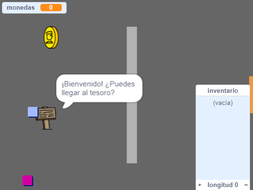

\--- no-print \---

Esta es una versión de **Scratch 3** del proyecto. También hay una [versión del proyecto en Scratch 2](https://projects.raspberrypi.org/en/projects/create-your-own-world-scratch2).

\--- /no-print \---

## Introducción

In this project, you'll learn how to create your own adventure game world with multiple levels to explore.

### Lo que harás

\--- no-print \---

Haz clic en la bandera verde para empezar. Utiliza las teclas de flecha para mover a tu personaje por el mundo.

  <iframe allowtransparency="true" width="485" height="402" src="https://scratch.mit.edu/projects/embed/258757783/?autostart=false" frameborder="0" scrolling="no"></iframe>
  

\--- /no-print \---

\--- print-only \---

You'll use the arrow keys to move your character around in the world. 

\--- /print-only \---

## \--- collapse \---

## title: Lo que necesitarás

### Hardware

- Una computadora capaz de hacer correr Scratch 3

### Software

- Scratch 3 (ya sea [online](http://rpf.io/scratchon){:target="_blank"} u [offline](http://rpf.io/scratchoff) {:target="_blank"})

### Descargas

You can find everything you need to complete this project at [rpf.io/p/en/create-your-own-world-go](https://rpf.io/p/en/create-your-own-world-go).

\--- /collapse \---

## \--- collapse \---

## title: Lo que vas a aprender

- Use conditional selection to react to key presses
- Use variables to store a game's state
- Use conditional selection based on the value of a variable
- Use lists to store data

\--- /collapse \---

## \--- collapse \---

## title: Información adicional para educadores

Si necesitas imprimir este proyecto, usa la [versión para imprimir](https://projects.raspberrypi.org/en/projects/create-your-own-world/print){:target="_blank"}.

You can find the [completed project here](https://rpf.io/p/en/create-your-own-world-get){:target="_blank"}.

\--- /collapse \---