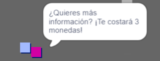
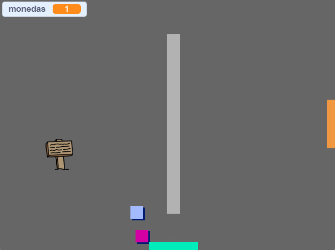

## Desafío: Amplía tu mundo

¡Ahora puedes seguir creando tu propio mundo! Aquí tienes algunas sugerencias:

+ Añade más monedas a tu juego en diferentes salas. ¿Puedes dejar que algunas monedas estén vigiladas por enemigos?
+ Cambia los fondos de tu juego
+ Añade sonido y música a tu juego
+ Añade más personajes, enemigos, señales y monedas
+ Añade puertas rojas y amarillas, y llaves especiales para abrirlas
+ Añade más habitaciones a tu mundo
+ Añade otros objetos útiles a tu juego
    
    + Usa monedas para obtener información de otras personas:



+ Incluso podrías añadir puertas en las paredes norte y sur de la habitación 1, de modo que el jugador pueda moverse entre habitaciones en las cuatro direcciones. Por ejemplo, tu juego puede tener nueve salas en una cuadrícula de 3×3. Entonces podrías sumar `3` al número de habitación para moverte al nivel inferior.

 

```blocks3
si <touching color [ ]?> entonces
cambia el telón de fondo a ((disfraz [número v]) + (3))
ve a x: (0) y: (200)
cambie [habitación v] por (3)
```