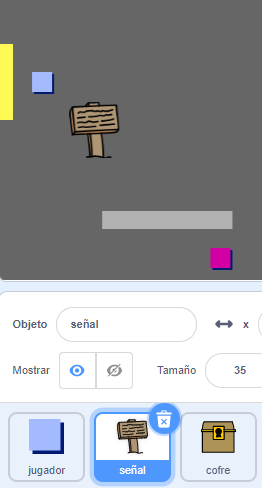
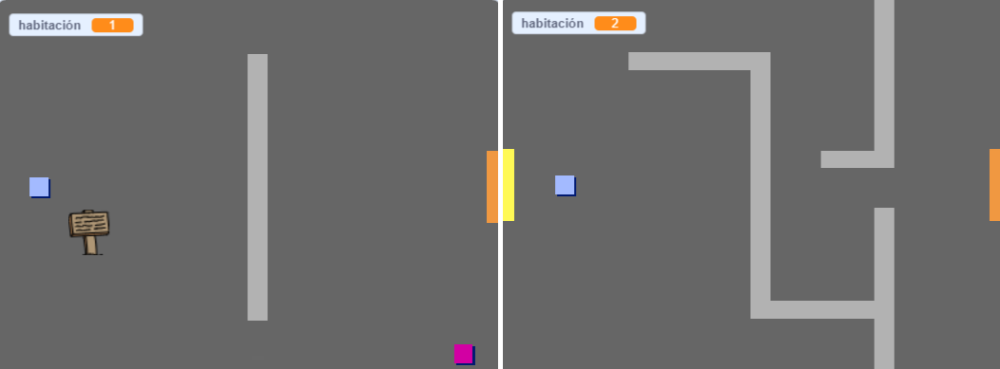
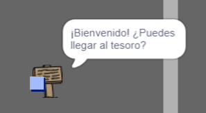

## Señales

Añadamos señales a tu mundo para guiar al jugador en su viaje.

Tu proyecto incluye un objeto `saludo`:



\--- Tarea \--- El objeto `signo de bienvenida` sólo debe ser visible en la sala 1, así que añade un poco de código al objeto para asegurarte de que ocurre:

\--- pistas \--- \--- pista \--- `Cuando se hace clic en la bandera `{:class="block3events"}, en un bucle `para siempre`{:class="block3control"}, marca `si`{:class="block3control"} la `habitación es 1`{:class="block3variables"} y en ese caso `muestra`{:class="block3looks"} el objeto` signo de bienvenida `, `en otro caso`{:class="block3control"} `ocultar`{:class="block3looks"} el objeto. \--- / pista \--- \--- / pistas \--- Aquí están los bloques de código que necesitarás:


```blocks3
<br />si < > entonces
en otro caso
fin

< (room :: variables) = [1] >

ocultar

mostrar

para siempre
fin

cuando se hace clic en la bandera

```

\--- / pista \--- \--- / pistas \--- Aquí está el código que necesitarás:


```blocks3
al hacer click en la bandera
para siempre
    si < (room :: variables) = [1] > entonces
        mostrar
    en otro caso
        ocultar
    fin
fin
```

\--- / pista \--- \--- / pistas \---

\--- /task \---

\--- Tarea \--- Prueba el código para tu objeto `señal de bienvenida ` moviendo entre las habitaciones. Tu señal solo debe ser visible en la habitación 1.

 \--- /task \---

\--- tarea \--- ¡Una señal no es muy buena si no dice nada! Añade un poco más de código para mostrar un mensaje si el objeto `saludo` es tocado por el objeto `jugador`:


```blocks3
al hacer click en la bandera
para siempre
 si < (room :: variables) = [1] > entonces
 mostrar
 en otro caso
 ocultar
 fin
+ si < tocando al (jugador v)? > entonces
decir [Bienvenido! ¿Puedes llegar al tesoro?]
más
decir []
fin
fin
```

\--- /task \---

\--- Tarea \--- Prueba tu objeto `símbolo de bienvenida` de nuevo. Ahora deberías ver un mensaje cuando el objeto `jugador` toca el objeto `signo de bienvenida`.

 \--- /task \---